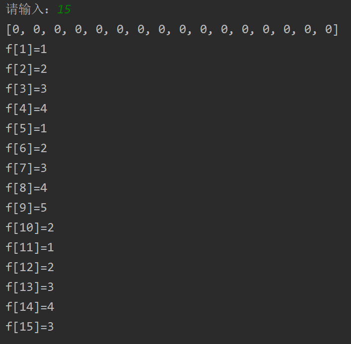
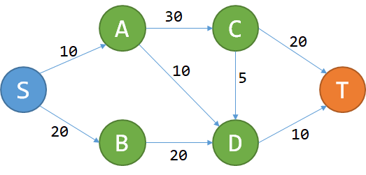

# 动态规划

本章节内容为对于动态规划课程的总结和复习。在本章中主要介绍动态规划概念及应用，以及几种与动态规划思想相同的算法。

## 什么是动态规划？

### 从一个生活问题谈起

假设你拥有足够的1，5，10，20，50，100元面值的钞票。目标是凑出某个金额w，**需要使用尽可能少的钞票。**

依据生活经验，我们可以采取这样的策略：能用100的就尽量使用100的，否则尽量使用50的，以此类推。在这种策略下，666=6*100+1*50+1*10+1*5+1*1，共使用了10张钞票。

这种策略被称之为“**贪心**”，假设我们面对的局面是“需要凑出w”，**贪心策略会尽快使w变得更小。**能让w少100就尽量让它少100，这样我们接下来面对的局面就是凑出w-100，生活经验表明，贪心策略是正确的。

但是，如果我们换一组钞票的面值，贪心策略就也许不成立了。如果一个国家的炒票面值分别为1、5、11，那么我们在凑出15的时候，贪心策略会出现问题：

    15=1*11+4*1（贪心策略使用了5张钞票）
    15=3*5（正确的策略，只用了5张钞票）

为什么会出现这种问题呢？贪心策略问题出在了哪里？

**鼠目寸光。**

如刚才所说，贪心策略的宗旨是：“尽量使接下来面对的w更小”。这样，贪心策略在w=15的时候，会优先使用11来把w降到4；但是在这个问题中，凑出4的代价是很高的，必须使用4*1.如果使用了5，w会降为10，虽然没有4那么小，但是凑出10只需要两张5元。

所以我们可以发现，贪心是一种只考虑眼前情况的策略。

那么我们如何才能避免这种情况呢？

如果通过暴力枚举凑出w的方案，明显复杂度过高。太多种方法可以凑出w了，枚举他们的时间是不能承受的。

重新分析刚刚的例子。w=15时，我们如果取11，接下来就面对w=4的情况；如果取5，则接下来面对w=10的情况。我们发现这些问题都有相同的形式：“给定w,凑出w所用的最少钞票时多少张？”接下来，我们使用f(n)来表示“凑出n所需的最少钞票数量”。

那么，如果我们取了11，最后的代价（用掉的钞票总数）是多少呢？

明显cost=f(4)+1=4+1=5,它的意义是：利用11来凑出15，付出的代价等于f(4)加上自己这一张钞票。我们现在暂时不管f(4)怎么求出来。

以此类推，马上可以知道：如果我们用5来凑出15，cost就是f(10) + 1 = 2 + 1 = 3.

那么，现在w=15的时候，我们该取用那种钞票呢？当然是各种方案中，cost最低的哪一个

- 取11：cost=f(4)+1=4+1=5
- 取5：cost=f(10)+1=2+1=3
- 取1：cost=f(14)+1=4+1=5

由此可见，cost值最低的方案时取5的方案。我们通过上面三个式子，做出了正确的决策！

这给了我们一个重要的启发——f(n)与f(n-1),f(n-5),f(n-11)相关；更准确地说：

$$ f(n)=min{f(n-1),f(n-5),f(n-11)}+1 $$

通过上述式子可知，想要求出f(n)只需要求出几个更小的f值就可以了，我们可以从小到大将所有的f(i)求出来。

python版实现代码如下：

```python
def search_min(n):
    m = int(n)
    f = []
    for i in range(m + 1):
        f.append(0)
    print(f)

    for i in range(1, m+1):
        cost = 100000
        if i - 1 >= 0:
            a1 = f[i - 1] + 1
            cost = min(cost, a1)
        if i - 5 >= 0:
            a2 = f[i - 5] + 1
            cost = min(cost, a2)
        if i - 11 >= 0:
            a3 = f[i - 11] + 1
            cost = min(cost, a3)
        f[i] = cost
        print('f[{0}]={1}'.format(i, f[i]))

if __name__ == '__main__':
    n = input("请输入：")
    search_min(n)
```

<center>



</center>

该方法以O(n)的复杂度解决了这个问题。

- f(n)只与f(n-1),f(n-5),f(n-11)的值相关。
- 只关心f(w)的值，不关心是怎么凑出w的。

对比于贪心策略，会分别算出取1、5、11的代价，从而做出一个正确的决策，避免了“鼠目寸光”。

与暴力枚举的区别在于暴力枚举会产生很多的冗余信息。然而我们需要找的是结果而不需要关心这个结果是怎么出来的。比如，要求出f(15),只需要知道f(14),f(10),f(4)的值。其他信息并不需要。我们舍弃了冗余信息。我们只记录了对解决问题有帮助的信息——f(n).

对于问题：求出f(n)，只需要知道几个更小的f(c)。**我们将求解f(c)称作求解f(n)的“子问题”。**

**这就是DP**（动态规划，dynamic programming）.

将一个问题拆成几个字问题，分别求解这些子问题，即可推断出大问题的解。

## 几个简单的概念

### 无后效性

一旦f(n)确定，“我们如何凑出f(n)”就再也用不着了。　　

要求出f(15)，只需要知道f(14),f(10),f(4)的值，而f(14),f(10),f(4)是如何算出来的，对之后的问题没有影响。　　

**“未来与过去无关”**，这就是**无后效性**。　　

（严格定义：如果给定某一阶段的状态，则在这一阶段以后过程的发展不受这阶段以前各段状态的影响。）


### 最优子结构

回顾我们对f(n)的定义：我们记“凑出n所需的**最少**钞票数量”为f(n).　　

f(n)的定义就已经蕴含了“最优”。利用w=14,10,4的**最优**解，我们即可算出w=15的**最优**解。　　

大问题的**最优解**可以由小问题的**最优解**推出，这个性质叫做“最优子结构性质”。　　

引入这两个概念之后，我们如何判断一个问题能否使用DP解决呢？　　

**能将大问题拆成几个小问题，且满足无后效性、最优子结构性质。**

## DP的典型应用：DAG最短路径

给定一个城市的地图，所有的道路都是单行道，而且不会构成环，每条道路都有过路费，求从S点到T点花费的最少费用。

<center>



一张地图，边上面的权重表示过路费。

</center>

我们尝试使用DP来解决这个问题，用P代表经历的点，想要到T，要么经过C，要么经过D。从而
$$ f(T) = min{f(C)+20,f(D)+10} $$

接下来检验刚刚的两个性质：
- 无后效性：对于点P，一旦f(P)确定，以后只需要确定f(P)的值，不需要关心过程。
- 最优子结构： 对于P，我们只需要关心到P的最小费用，即f(P)。如果从S走到T是S->P->Q->T,那么S走到Q的最优路径是S->P->Q。对于一条最优路径而言，从S走到沿途上所有的点（子问题）的最优路径，都是这条路的一部分。

满足上述性质，可构建式子

$$ f(P)=\min\{f(R)+w_{R→P}\} $$

其中R为到P点道路上的所有点，w_R→P为R到P的过路费。

代码使用拓扑排序即可。

## 对于DP原理的探讨

### DP的核心思想
    DP为什么会快？
    无论是DP还是暴力枚举，算法原则上都是在可能解的空间中，寻找最优解。

    回到刚刚的钞票问题，暴力枚举的方法是通过枚举列出所有的可能姐，建立了完整的可能解的空间。然而DP是枚举有希望成为答案的解，所以DP所建立的解空间比暴力枚举所建立的解空间要小得多。

    换句话说，DP算法自带筛选功能。

    DP舍弃了不可能成为最优解的答案，例如
    15 = 5+5+5 被考虑了。
    15 = 5+5+1+1+1+1+1 从来没有考虑过，因为这不可能成为最优解。

    由此可见，DP的核心思想就是尽量缩小可能解的空间。

    在暴力枚举算法中，可能解的空间往往是指数级的大小；然而在DP算法中，有可能将解空间的大小降到多项式量级。

> 时间复杂度量级分为多项式量级和非多项式量级。其中非多项式量级只有两个：O(2^n)和O(n!)。
> 多项量级就是说这个时间复杂度是由n作为底数的O(n) O(nlogn) ,非多项量级就是n不是作为底数O(2^n) 指数阶级。

一般而言，解的空间越小，寻找解的速度越快。

### DP的操作过程

    一句话来概括就是：**大事化小，小事化了**。

    将一个大问题分解成几个小问题；
    求出每个小问题；
    推导出大问题的解。

### 如何设计DP算法

    介绍比较通用的设计DP算法的步骤。

    首先，把要面对的情况表示为x，这一步骤称为设计状态。

    对于状态x，记我们所要求出的答案（比如最小费用）为f(x),目标是要求出f(T).

找出f(x)与哪些情况有关（记为p），写出一个式子（称为状态转移方程），通过f(p)来推出f(x).

### DP三连

    设计DP算法，往往可以遵循DP三连：　　
        我是谁？  ——设计状态，表示情况　　
        我从哪里来？　　
        我要到哪里去？  ——设计转移　　
    
    设计状态是DP的基础。接下来的设计转移，有两种方式：一种是考虑我从哪里来（本文之前提到的两个例子，都是在考虑“我从哪里来”）；另一种是考虑我到哪里去，这常见于求出f(x)之后，更新能从x走到的一些解。这种DP也是不少的，我们以后会遇到。　　
    总而言之，“我从哪里来”和“我要到哪里去”只需要考虑清楚其中一个，就能设计出状态转移方程，从而写代码求解问题。
    
> 思考题：如何把钞票问题的代码改写成“我到哪里去”的形式？提示：求出f(x)之后，更新f(x+1),f(x+5),f(x+11).

## 举个例子：最长上升子序列

最长上升子序列（LIS）问题：给定长度为n的序列a，从a中抽取出一个子序列，这个子序列需要单调递增。问最长的上升子序列（LIS）的长度。
    e.g. 1,5,3,4,6,9,7,8的LIS为1,3,4,6,7,8，长度为6。

    如何设计状态（我是谁）？　　
    
    我们记f(x)为以a_X结尾的LIS长度，那么答案就是max{f(x)}.　　
    
    状态x从哪里推过来（我从哪里来）？　　
    
    考虑比x小的每一个p：如果a_x>a_p，那么f(x)可以取f(p)+1.　　
    
    解释：我们把a_x接在a_p的后面，肯定能构造一个以a_x结尾的上升子序列，长度比以a_p结尾的LIS大1.那么，我们可以写出状态转移方程了：　　
    
$$ f(x)=\max_{p<x , a_p<a_x }⁡\{f(p)\}+1 $$

    至此解决问题。两层for循环，复杂度O(n^2).


## 本文参考
1. [算法导论（原书第3版）[美] Thomas H.Cormen，[美] Charles E.Leiserson，[美] Ronald L.Rivest，[美] Clifford Stein 著，殷建平，徐云，王刚 等 译](https://item.jd.com/11144230.html)
2. [什么是动态规划（Dynamic Programming）？动态规划的意义是什么？](https://www.zhihu.com/question/23995189)
3. [多项式量级和非多项式量级是什么意思](https://blog.csdn.net/MChuajian/article/details/86301806)
4. 