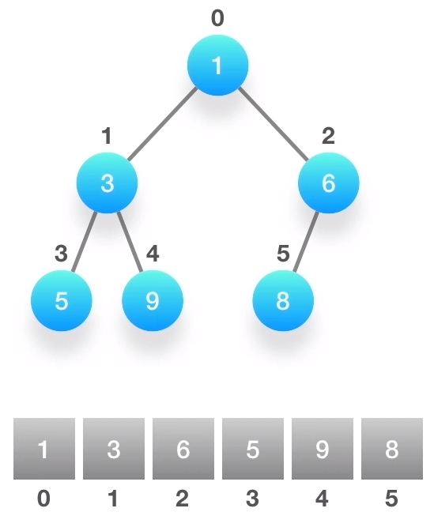
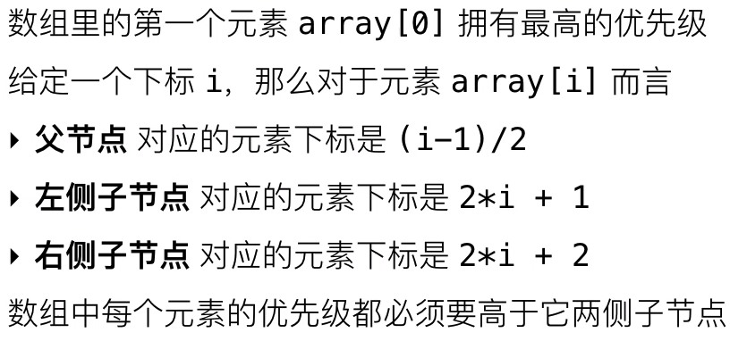
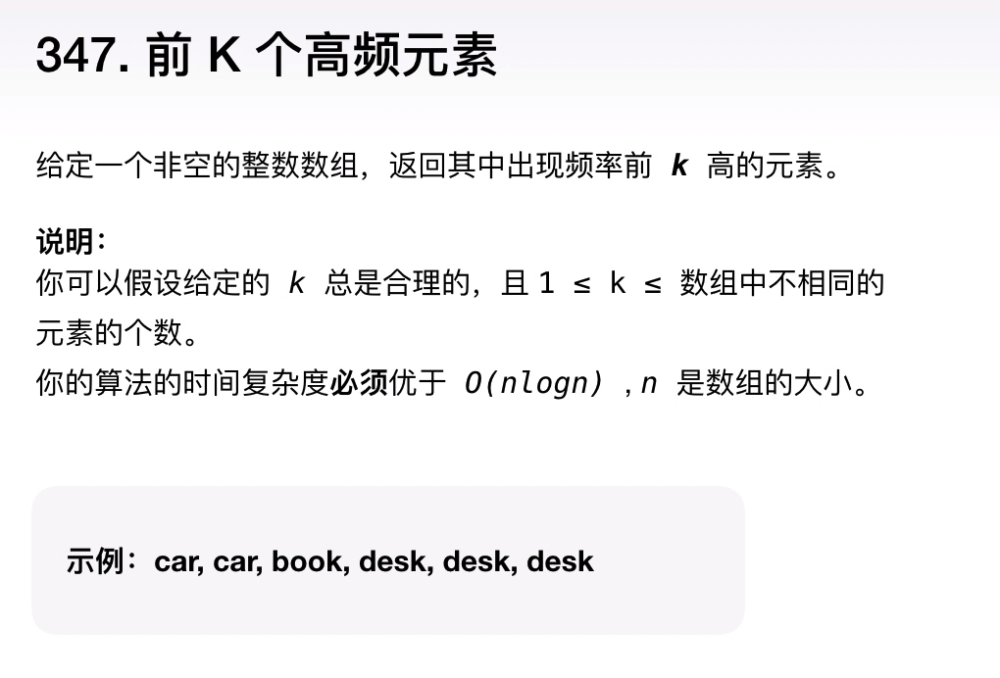

# 高级数据结构

- 优先队列 / Priority Queue
- 图 / Graph
- 前缀树 / Trie
- 线段树 / Segment Tree
- 树形数组 / Fenwick Tree / Binary Indexed Tree

## 优先队列

**与普通队列区别**

保证每次取出的元素是从队列中优先级最高的

优先级别可自定义

**最常用的场景**

从杂乱无章的数据中按照一定的顺序（或者优先级）筛选数据

**本质**

二叉堆的结构，堆在英文里叫Binary Heap

利用一个数组结构来实现完全二叉树

**特性**

 

**基本操作可以分为两个**

- 向上筛选
- 向下筛选

**另一个最重要的时间复杂度：优先队列的初始化**

**例题：**

通过频率前K高的元素字眼确定使用优先队列，优先级可以通过出现的次数来确定（多高少低）。

## 图

**基本知识点如下：**

- 阶、度

- 树、森林、环

- 有向图、无向图、完全有向图、完全无向图
- 连通图、连通分量
- 图的存储和表达方式：邻接矩阵、邻接链表

**图的算法也是各式各样**

- 图的遍历：深度优先、广度优先
- 环的检测：有向图、无向图
- 拓扑排序

- 最短路径算法：Dijkstra、Bellman-Ford、Floyd Warshall

- 连通性相关算法：Kosaraju、Tarjan、求解孤岛的数量、判断是否为树

- 图的着色、旅行商问题等

以上的知识点只是图论里的冰山一角，对于算法面试而言，完全不需要对每个知识点都一一掌握，而应该有的放矢地进行准备。

**必会知识点**
根据长期的经验总结，以下的知识点是必须充分掌握并反复练习的。

- 图的存储和表达方式：邻接矩阵（Adjacency Matrix）、邻接链表（Adjacency List）

- 图的遍历：深度优先、广度优先

- 二部图的检测（Bipartite）、树的检测、环的检测：有向图、无向图

- 拓扑排序

- 联合-查找算法（Union-Find）

- 最短路径：Dijkstra、Bellman-Ford

其中，环的检测、二部图的检测、树的检测以及拓扑排序都是基于图的遍历，尤其是深度优先方式的遍历。而遍历可以在邻接矩阵或者邻接链表上进行，所以掌握好图的遍历是重中之重！因为它是所有其他图论算法的基础。

至于最短路径算法，能区分它们的不同特点，知道在什么情况下用哪种算法就很好了。对于有充足时间准备的面试者，能熟练掌握它们的写法当然是最好的。

建议：LeetCode 里边有许多关于图论的算法题，而且都是非常经典的题目，可以通过练习解题来熟练掌握必备知识。

**例题分析**

LeetCode 第 785 题：给定一个无向图 graph，当这个图为二部图时返回 true。

提示：如果能将一个图的节点集合分割成两个独立的子集 A 和 B，并使图中的每一条边的两个节点一个来自 A 集合，一个来自 B 集合，就将这个图称为二部图。

**解题思路**

判断一个给定的任意图是否为二部图，就必须要对该图进行一次遍历：

- 深度优先

- 广度优先

（关于深度优先和广度优先算法，将在第 06 节课进行详细讨论）。

二部图，图的所有顶点可以分成两个子集 U 和 V，子集里的顶点互不直接相连，图里面所有的边，一头连着子集 U 里的顶点，一头连着子集 V 里的顶点。

1. 给图里的顶点涂上颜色，子集 U 里的顶点都涂上红色，子集 V 里的顶点都涂上蓝色。
2. 开始遍历这个图的所有顶点，想象一下手里握有红色和蓝色的画笔，每次交替地给遍历当中遇到的顶点涂上颜色。
3. 如果这个顶点还没有颜色，那就给它涂上颜色，然后换成另外一支画笔。
4. 下一个顶点，如果发现这个顶点已经涂上了颜色，而且颜色跟我手里画笔的颜色不同，那么表示这个顶点它既能在子集 U 里，也能在子集 V 里。
5. 所以，它不是一个二部图。