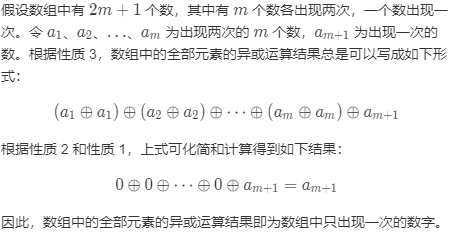

# [136. 只出现一次的数字](https://leetcode-cn.com/problems/single-number/)

给定一个非空整数数组，除了某个元素只出现一次以外，其余每个元素均出现两次。找出那个只出现了一次的元素。

说明：

你的算法应该具有线性时间复杂度。 你可以不使用额外空间来实现吗？ 

示例 1:

    输入: [2,2,1]
    输出: 1
示例 2:

    输入: [4,1,2,1,2]
    输出: 4
## 思路
首先考虑两件事情
- 第一，线性时间复杂度。
- 第二，不适用额外的空间。
### 暴力破解
遍历整个列表，用列表自带的count计算出现次数，如果只出现过一次，就返回这个值。
```python
class Solution:
    def singleNumber(self, nums: List[int]) -> int:
        Lens = len(nums)
        for i in range(Lens):
            a = nums[i]
            b = nums.count(a)
            if b == 1:
                return a
```
时间复杂度：O(n^2),遍历数组的时候还要统计值，相当于在遍历一次。
空间复杂度：O(1)。
### 位运算
>参考：https://leetcode-cn.com/problems/single-number/solution/zhi-chu-xian-yi-ci-de-shu-zi-by-leetcode-solution/

如果没有时间复杂度和空间复杂度的限制，这道题有很多种解法，可能的解法有如下几种。

使用集合存储数字。遍历数组中的每个数字，如果集合中没有该数字，则将该数字加入集合，如果集合中已经有该数字，则将该数字从集合中删除，最后剩下的数字就是只出现一次的数字。

使用哈希表存储每个数字和该数字出现的次数。遍历数组即可得到每个数字出现的次数，并更新哈希表，最后遍历哈希表，得到只出现一次的数字。

使用集合存储数组中出现的所有数字，并计算数组中的元素之和。由于集合保证元素无重复，因此计算集合中的所有元素之和的两倍，即为每个元素出现两次的情况下的元素之和。由于数组中只有一个元素出现一次，其余元素都出现两次，因此用集合中的元素之和的两倍减去数组中的元素之和，剩下的数就是数组中只出现一次的数字。

上述三种解法都需要额外使用 O(n)O(n) 的空间，其中 nn 是数组长度。如果要求使用线性时间复杂度和常数空间复杂度，上述三种解法显然都不满足要求。那么，如何才能做到线性时间复杂度和常数空间复杂度呢？

答案是使用位运算。对于这道题，可使用异或运算 \oplus⊕。异或运算有以下三个性质。

任何数和 0 做异或运算，结果仍然是原来的数，即 a⊕0=a 。
任何数和其自身做异或运算，结果是 00，即 a⊕a=0。
异或运算满足交换律和结合律，即 a⊕b⊕a=b⊕a⊕a=b⊕(a⊕a)=b⊕0=b。




```python
class Solution:
    def singleNumber(self, nums: List[int]) -> int:
        return reduce(lambda x, y: x ^ y, nums) #匿名函数做异或运算
```
>reduce() 函数会对参数序列中元素进行累积。<br>
函数将一个数据集合（链表，元组等）中的所有数据进行下列操作：用传给 reduce 中的函数 function（有两个参数）先对集合中的第 1、2 个元素进行操作，得到的结果再与第三个数据用 function 函数运算，最后得到一个结果。
**复杂度分析**

时间复杂度：O(n)，其中 n 是数组长度。只需要对数组遍历一次。

空间复杂度：O(1)。

### 哈希表
>参考：https://leetcode-cn.com/problems/single-number/solution/xue-suan-fa-jie-guo-xiang-dui-yu-guo-cheng-bu-na-y/

利用 Hash 表，Time: O(n) Space: O(n)
```Java
class Solution {
    public int singleNumber(int[] nums) {
        Map<Integer, Integer> map = new HashMap<>();
        for (Integer i : nums) {
            Integer count = map.get(i);
            count = count == null ? 1 : ++count;
            map.put(i, count);
        }
        for (Integer i : map.keySet()) {
            Integer count = map.get(i);
            if (count == 1) {
                return i;
            }
        }
        return -1; // can't find it.
    }
}
```
