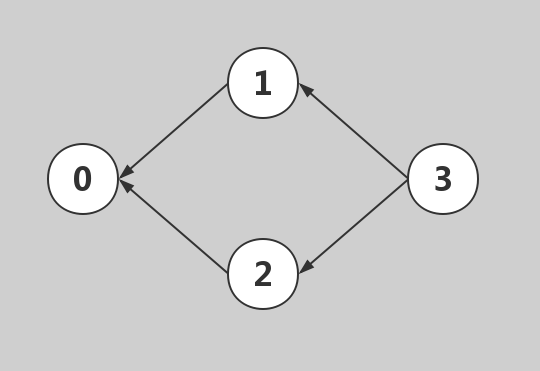

# [210. 课程表 II](https://leetcode-cn.com/problems/course-schedule-ii/)

现在你总共有 n 门课需要选，记为 0 到 n-1。

在选修某些课程之前需要一些先修课程。 例如，想要学习课程 0 ，你需要先完成课程 1 ，我们用一个匹配来表示他们: [0,1]

给定课程总量以及它们的先决条件，返回你为了学完所有课程所安排的学习顺序。

可能会有多个正确的顺序，你只要返回一种就可以了。如果不可能完成所有课程，返回一个空数组。

**示例 1:**

    输入: 2, [[1,0]] 
    输出: [0,1]
    解释: 总共有 2 门课程。要学习课程 1，你需要先完成课程 0。因此，正确的课程顺序为 [0,1] 。
**示例 2:**

    输入: 4, [[1,0],[2,0],[3,1],[3,2]]
    输出: [0,1,2,3] or [0,2,1,3]
    解释: 总共有 4 门课程。要学习课程 3，你应该先完成课程 1 和课程 2。并且课程 1 和课程 2 都应该排在课程 0 之后。
         因此，一个正确的课程顺序是 [0,1,2,3] 。另一个正确的排序是 [0,2,1,3] 。
**说明:**

1. 输入的先决条件是由边缘列表表示的图形，而不是邻接矩阵。详情请参见[图的表示法](http://blog.csdn.net/woaidapaopao/article/details/51732947)。
2. 你可以假定输入的先决条件中没有重复的边。
**提示:**

1. 这个问题相当于查找一个循环是否存在于有向图中。如果存在循环，则不存在拓扑排序，因此不可能选取所有课程进行学习。
2. [通过 DFS 进行拓扑排序](https://www.coursera.org/specializations/algorithms) - 一个关于Coursera的精彩视频教程（21分钟），介绍拓扑排序的基本概念。
3. 拓扑排序也可以通过 [BFS](https://baike.baidu.com/item/%E5%AE%BD%E5%BA%A6%E4%BC%98%E5%85%88%E6%90%9C%E7%B4%A2/5224802?fr=aladdin&fromid=2148012&fromtitle=%E5%B9%BF%E5%BA%A6%E4%BC%98%E5%85%88%E6%90%9C%E7%B4%A2) 完成。

## 思路
本题可以将输入的课程以及课程之间的关系转化为图结构进行处理，比如示例1中2中四个课程可以视作图中的四个节点，然后作有向图，示例如下：
<center>



</center>

### 基本的广度优先遍历（BFS）
   1）、将图进行加工，得到更直观的图。初始化一个列表graph，该列表的元素长度为课程数，列表元素是一个子列表，子列表由三个元素，第一个元素是该顶点的入度数，第二个元素是该顶点的顶点值，第三个元素是包含指向所有的顶点元素的顶点值的列表集合。遍历给出的列表prerequisites，获得第一个元素的值i，j，将graph[i][0]加1，即graph中顶点值为i的子列表的第一个元素（入度数）加1，将graph[j][2].append(i)，即将graph中顶点值为j的顶点指向的顶点列表集合添加顶点值为i的顶点。

     2）、得到加工后的图，定义辅助栈，初始化将graph中入度数为0的顶点压入栈中，再定义一个记录已经访问的顶点的set集合。

     3）、以栈不为空作为循环条件，进入循环，弹出栈顶元素，将顶点值添加进拓扑排序表，将其指向的顶点入度数减1；再对graph进行遍历，将入度数为0且顶点值不在记录已经访问的set集合里面的顶点入栈。

     4）、重复第三步，退出循环后，判断拓扑排序表的长度是否等于课程数，若是，则代表拓扑排序成功，若不等于，则代表图不是有向无环图，拓扑排序失败，返回空列表。
>参考：https://blog.csdn.net/LesuperV/article/details/100127770

代码如下：
```python
class Solution:
    def findOrder(self, numCourses: int, prerequisites: List[List[int]]) -> List[int]:
        empty = []                                          #   先设置一个空的列表，以满足在某几种情况下为空输出
        if prerequisites == []:                             #   当输入课程之间关系为空的时候
            for i in range(numCourses):                     #   依次将课程用头插的方式存入列表即可
                empty.insert(0,i)
            return empty                                    #   返回输出
        grap = [[0, _, []] for _ in range(numCourses)]      #   根据输入建立图结构数据，即二维列表
        for i in prerequisites:                             #   遍历输入列表，注意这里的prerequisites是一个二维列表
            grap[i[0]][0] += 1                              #   列表的第i[0]（即输入二维列表的第一个列表的第一个值）行第0列加一
            grap[i[1]][2].append(i[0])                      #   列表的第i[1]（即输入二维列表的第一个列表的第二个值）行第2列插入输入二维列表的第一个列表
        queue = []                                          #   建立队列
        visited = set()                                     #   建立访问集合
        for i in grap:                                      #   遍历grap
            if i[0] == 0:                                   #   如果
                queue.append(i)
                visited.add(i[1])
        if queue == []:
            return empty
        results = []
        while queue:
            cur = queue.pop()
            results.append(cur[1])
            for j in cur[2]:
                grap[j][0] -= 1
            for n in grap:
                if n[0] == 0 and n[1] not in visited:
                    queue.append(n)
                    visited.add(n[1])
        if len(results) == numCourses:
            return results
        else:
            return empty
```

## 大神思路

>参考：https://leetcode-cn.com/problems/course-schedule-ii/solution/tuo-bu-pai-xu-shen-du-you-xian-bian-li-python-dai-/
先说最重要的部分：

「拓扑排序」是专门应用于有向图的算法；
这道题用 BFS 和 DFS 都可以完成，只需要掌握 BFS 的写法就可以了，BFS 的写法很经典；
BFS 的写法就叫「拓扑排序」，这里还用到了贪心算法的思想，贪的点是：当前让入度为 0 的那些结点入队；
「拓扑排序」的结果不唯一；
删除结点的操作，通过「入度数组」体现，这个技巧要掌握；
「拓扑排序」的一个附加效果是：能够顺带检测有向图中是否存在环，这个知识点非常重要，如果在面试的过程中遇到这个问题，要把这一点说出来。
具有类似附加功能的算法还有：Bellman-Ford 算法附加的作用是可以用于检测是否有负权环（在这里不展开了，我也不太熟）。

### 方法一：拓扑排序（Kahn 算法、类似广度优先遍历的思路）


如果优先图中，存在环，拓扑排序不能继续得到入度值为 0 的节点，退出循环，此时图中存在没有遍历到的节点，说明图中存在环。

此时说明课程设计不合理，有循环依赖。


拓扑排序实际上应用的是贪心算法，贪心算法简而言之：每一步最优，则全局最优。

具体到拓扑排序，每一次都从图中删除没有前驱的顶点，这里并不需要真正的做删除操作，我们可以设置一个入度数组，每一轮都输出入度为 00 的结点，并移除它、修改它指向的结点的入度（-1−1即可），依次得到的结点序列就是拓扑排序的结点序列。如果图中还有结点没有被移除，则说明“不能完成所有课程的学习”。

拓扑排序保证了每个活动（在这题中是“课程”）的所有前驱活动都排在该活动的前面，并且可以完成所有活动。拓扑排序的结果不唯一。拓扑排序还可以用于检测一个有向图是否有环。相关的概念还有 AOV 网，这里就不展开了。

**算法流程：**

1、在开始排序前，扫描对应的存储空间（使用邻接表），将入度为 0 的结点放入队列。

2、只要队列非空，就从队首取出入度为 0 的结点，将这个结点输出到结果集中，并且将这个结点的所有邻接结点（它指向的结点）的入度减 1，在减 1 以后，如果这个被减 1 的结点的入度为 0 ，就继续入队。

3、当队列为空的时候，检查结果集中的顶点个数是否和课程数相等即可。

（思考这里为什么要使用队列？如果不用队列，还可以怎么做，会比用队列的效果差还是更好？）

在代码具体实现的时候，除了保存入度为 0 的队列，我们还需要两个辅助的数据结构：

1、邻接表：通过结点的索引，我们能够得到这个结点的后继结点；

2、入度数组：通过结点的索引，我们能够得到指向这个结点的结点个数。

这个两个数据结构在遍历题目给出的邻边以后就可以很方便地得到。

代码1：
```python
class Solution(object):
    def findOrder(self, numCourses, prerequisites):
        """
        :type numCourses: int 课程门数
        :type prerequisites: List[List[int]] 课程与课程之间的关系
        :rtype: bool
        """
        # 课程的长度
        clen = len(prerequisites)
        if clen == 0:
            # 没有课程，当然可以完成课程的学习
            return [i for i in range(numCourses)]
        # 入度数组，一开始全部为 0
        in_degrees = [0 for _ in range(numCourses)]
        # 邻接表
        adj = [set() for _ in range(numCourses)]
        # 想要学习课程 0 ，你需要先完成课程 1 ，我们用一个匹配来表示他们: [0,1]
        # 1 -> 0，这里要注意：不要弄反了
        for second, first in prerequisites:
            in_degrees[second] += 1
            adj[first].add(second)

        # print("in_degrees", in_degrees)
        # 首先遍历一遍，把所有入度为 0 的结点加入队列
        res = []
        queue = []
        for i in range(numCourses):
            if in_degrees[i] == 0:
                queue.append(i)

        while queue:
            top = queue.pop(0)
            res.append(top)

            for successor in adj[top]:
                in_degrees[successor] -= 1
                if in_degrees[successor] == 0:
                    queue.append(successor)
        if len(res) != numCourses:
            return []
        return res
```
复杂度分析：

**时间复杂度**：O(E + V)。这里 E 表示邻边的条数，V表示结点的个数。初始化入度为 0 的集合需要遍历整张图，具体做法是检查每个结点和每条边，因此复杂度为 O(E+V)，然后对该集合进行操作，又需要遍历整张图中的每个结点和每条边，复杂度也为 O(E+V)；

**空间复杂度**：O(V)：入度数组、邻接表的长度都是结点的个数 V，即使使用队列，队列最长的时候也不会超过 V，因此空间复杂度是 O(V)。


### 方法二：深度优先遍历（不用掌握，因为要检测环，代码中会做一些处理，代码没有参考价值）
这里要使用逆邻接表。其实就是检测这个有向图中有没有环，只要存在环，这些课程就不能按要求学完。

算法流程：

第 1 步：构建逆邻接表；

第 2 步：递归处理每一个还没有被访问的结点，具体做法很简单：对于一个结点来说，先输出指向它的所有顶点，再输出自己。

第 3 步：如果这个顶点还没有被遍历过，就递归遍历它，把所有指向它的结点都输出了，再输出自己。注意：当访问一个结点的时候，应当先递归访问它的前驱结点，直至前驱结点没有前驱结点为止。

代码如下：
```python
class Solution(object):

    def findOrder(self, numCourses, prerequisites):
        """
        :type numCourses: int 课程门数
        :type prerequisites: List[List[int]] 课程与课程之间的关系
        :rtype: bool
        """
        # 课程的长度
        clen = len(prerequisites)
        if clen == 0:
            # 没有课程，当然可以完成课程的学习
            return [i for i in range(numCourses)]

        # 逆邻接表
        inverse_adj = [set() for _ in range(numCourses)]
        # 想要学习课程 0 ，你需要先完成课程 1 ，我们用一个匹配来表示他们: [0,1]
        # 1 -> 0，这里要注意：不要弄反了
        for second, first in prerequisites:
            inverse_adj[second].add(first)

        visited = [0 for _ in range(numCourses)]
        # print("in_degrees", in_degrees)
        # 首先遍历一遍，把所有入度为 0 的结点加入队列

        res = []
        for i in range(numCourses):
            if self.__dfs(i,inverse_adj, visited, res):
                return []
        return res

    def __dfs(self, vertex, inverse_adj, visited, res):
        """
        注意：这个递归方法的返回值是返回是否有环
        :param vertex: 结点的索引
        :param inverse_adj: 逆邻接表，记录的是当前结点的前驱结点的集合
        :param visited: 记录了结点是否被访问过，2 表示当前正在 DFS 这个结点
        :return: 是否有环
        """
        # 2 表示这个结点正在访问
        if visited[vertex] == 2:
            # DFS 的时候如果遇到一样的结点，就表示图中有环，课程任务便不能完成
            return True
        if visited[vertex] == 1:
            return False
        # 表示正在访问这个结点
        visited[vertex] = 2
        # 递归访问前驱结点
        for precursor in inverse_adj[vertex]:
            # 如果没有环，就返回 False，
            # 执行以后，逆拓扑序列就存在 res 中
            if self.__dfs(precursor, inverse_adj, visited, res):
                return True

        # 能走到这里，说明所有的前驱结点都访问完了，所以可以输出了
        # 并且将这个结点状态置为 1
        visited[vertex] = 1

        # 先把 vertex 这个结点的所有前驱结点都输出之后，再输出自己
        res.append(vertex)
        # 最后不要忘记返回 False 表示无环
        return False
```
#### 复杂度分析

**时间复杂度**：O(E + V)O(E+V)；

**空间复杂度**：O(V)O(V)。