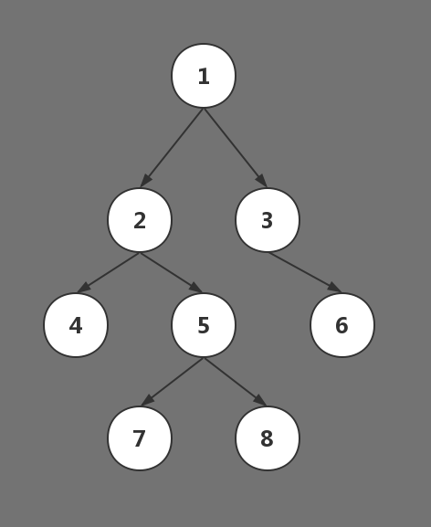

# [105. 从前序与中序遍历序列构造二叉树](https://leetcode-cn.com/problems/construct-binary-tree-from-preorder-and-inorder-traversal/)

根据一棵树的前序遍历与中序遍历构造二叉树。

**注意:**<br>
你可以假设树中没有重复的元素。

例如，给出

    前序遍历 preorder = [3,9,20,15,7]
    中序遍历 inorder = [9,3,15,20,7]
返回如下的二叉树：

        3
       / \
      9  20
        /  \
       15   7

## 思路

首先复习一下前序遍历和中序遍历，外加后序遍历的概念。

前序遍历：root->lchild->rchild

中序遍历：lchild->root->rchild

后序遍历：lchild->rchild->root

举个栗子~

<center>



</center>

前序遍历：1  2  4  5  7  8  3  6 

中序遍历：4  2  7  5  8  1  3  6

后序遍历：4  7  8  5  2  6  3  1

层次遍历：1  2  3  4  5  6  7  8

### 递归
>参考：https://leetcode-cn.com/problems/construct-binary-tree-from-preorder-and-inorder-traversal/solution/python-di-gui-xiang-jie-by-jalan/

```python
# Definition for a binary tree node.
# class TreeNode(object):
#     def __init__(self, x):
#         self.val = x
#         self.left = None
#         self.right = None

class Solution(object):
    def buildTree(self, preorder, inorder):
        """
        :type preorder: List[int]
        :type inorder: List[int]
        :rtype: TreeNode
        """
        if len(inorder) == 0:
            return None
        # 前序遍历第一个值为根节点
        root = TreeNode(preorder[0])
        # 因为没有重复元素，所以可以直接根据值来查找根节点在中序遍历中的位置
        mid = inorder.index(preorder[0])
        # 构建左子树
        root.left = self.buildTree(preorder[1:mid+1], inorder[:mid])
        # 构建右子树
        root.right = self.buildTree(preorder[mid+1:], inorder[mid+1:])
        
        return root
```

### 迭代
>参考：https://leetcode-cn.com/problems/construct-binary-tree-from-preorder-and-inorder-traversal/solution/cong-qian-xu-yu-zhong-xu-bian-li-xu-lie-gou-zao-9/

```python
class Solution:
    def buildTree(self, preorder: List[int], inorder: List[int]) -> TreeNode:
        if not preorder:
            return None

        root = TreeNode(preorder[0])
        stack = [root]
        inorderIndex = 0
        for i in range(1, len(preorder)):
            preorderVal = preorder[i]
            node = stack[-1]
            if node.val != inorder[inorderIndex]:
                node.left = TreeNode(preorderVal)
                stack.append(node.left)
            else:
                while stack and stack[-1].val == inorder[inorderIndex]:
                    node = stack.pop()
                    inorderIndex += 1
                node.right = TreeNode(preorderVal)
                stack.append(node.right)

        return root
```