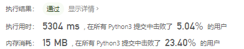
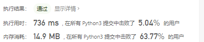
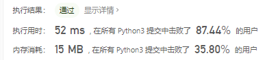
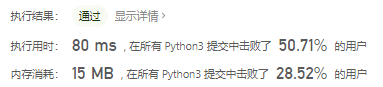
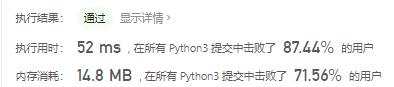

# [39. 组合总和](https://leetcode-cn.com/problems/combination-sum/)

给定一个**无重复元素**的数组 `candidates` 和一个目标数 `target` ，找出 `candidates` 中所有可以使数字和为 `target` 的组合。

`candidates` 中的数字可以无限制重复被选取。

说明：

- 所有数字（包括 target）都是正整数。
- 解集不能包含重复的组合。 

```
示例 1：

输入：candidates = [2,3,6,7], target = 7,
所求解集为：
[
  [7],
  [2,2,3]
]
```


示例 2：

```
输入：candidates = [2,3,5], target = 8,
所求解集为：
[
  [2,2,2,2],
  [2,3,3],
  [3,5]
]
```


提示：

- 1 <= candidates.length <= 30
- 1 <= candidates[i] <= 200
- candidate 中的每个元素都是独一无二的。
- 1 <= target <= 500

## 思路

参考[78. 子集](https://leetcode-cn.com/problems/subsets/)中回溯算法思路，遍历元素，然后选取所有加和小于target的子集，然后在从这些子集中找到等于target的结果子集。初始版本，提供思路代码较为复杂，且时间复杂度过高。

```python
class Solution:
    def combinationSum(self, candidates: List[int], target: int) -> List[List[int]]:
        res = []
        n = len(candidates)

        def helper(tmp):
            tmp = sorted(tmp)
            if sum(tmp) == target and tmp not in res:
                res.append(tmp)
            for j in range(n):
                if sum(tmp) < target:
                    helper(tmp + [candidates[j]])

        helper([])
        return res
```



稍微改进了一下重复元素判定部分的逻辑，将sorted改为了在进列表时就为有序进入，整个时间复杂度大幅下降。

```python
class Solution:
    def combinationSum(self, candidates: List[int], target: int) -> List[List[int]]:
        res = []
        n = len(candidates)

        def helper(tmp):
            # tmp = sorted(tmp)
            if sum(tmp) == target and tmp not in res:
                res.append(tmp)
            for j in range(n):
                if len(tmp) == 0:
                    helper(tmp + [candidates[j]])
                elif sum(tmp) < target and candidates[j] >= tmp[-1]:
                    helper(tmp + [candidates[j]])

        helper([])
        return res
```



#### 参考题解

看了一下提交中用时最少的题解，采用的是dfs思想。

1. 让candidates称为有序list
2. 设置结果列表ans
3. 设置dfs函数，参数为起始元素索引、每次传入的列表、目标长度。

```python
class Solution:
    def combinationSum(self, candidates: List[int], target: int) -> List[List[int]]:
        candidates = sorted(candidates)
        ans = []

        def dfs(s, m, target):
            for i in range(s, len(candidates)):
                tmp = candidates[i]
                if tmp == target: #  如果这个元素与target相等那就直接成为一个结果list
                    ans.append(m + [tmp])
                elif tmp < target: # 如果比这个小就递归，m + [tmp]为结果list的当前状态，target-tmp为剩余的目标长度
                    dfs(i, m + [tmp], target - tmp)
                else:
                    return

        dfs(0, [], target)
        return ans
```



### [回溯算法 + 剪枝（回溯经典例题详解）](https://leetcode-cn.com/problems/combination-sum/solution/hui-su-suan-fa-jian-zhi-python-dai-ma-java-dai-m-2/)

思路分析：根据示例 1：输入: `candidates = [2, 3, 6, 7]`，`target = 7`。

- 候选数组里有 `2`，如果找到了组合总和为 `7 - 2 = 5` 的所有组合，再在之前加上 `2` ，就是 `7` 的所有组合；
- 同理考虑 `3`，如果找到了组合总和为 `7 - 3 = 4` 的所有组合，再在之前加上 `3` ，就是 `7` 的所有组合，依次这样找下去。
  基于以上的想法，可以画出如下的树形图。建议大家自己在纸上画出这棵树，**这一类问题都需要先画出树形图，然后编码实现**。

编码通过 **深度优先遍历** 实现，使用一个列表，在 **深度优先遍历** 变化的过程中，遍历所有可能的列表并判断当前列表是否符合题目的要求，成为「回溯算法」。

#### 画出树形图

2020 年 9 月 9 日补充：以下给出的是一种树形图的画法。对于组合来说，还可以根据一个数选和不选画树形图，请参考  [官方题解](https://leetcode-cn.com/problems/combination-sum/solution/zu-he-zong-he-by-leetcode-solution/) 或者 [@elegant-pike](https://leetcode-cn.com/u/elegant-pike/) 的 [评论](https://leetcode-cn.com/problems/combination-sum/solution/hui-su-suan-fa-jian-zhi-python-dai-ma-java-dai-m-2/583297)。

以输入：`candidates = [2, 3, 6, 7]`, `target = 7` 为例：


说明：

- 以 `target = 7` 为 **根结点** ，创建一个分支的时 **做减法** ；

- 每一个箭头表示：从父亲结点的数值减去边上的数值，得到孩子结点的数值。边的值就是题目中给出的 `candidate` 数组的每个元素的值；

- 减到 0 或者负数的时候停止，即：结点 0 和负数结点成为叶子结点；

- 所有从根结点到结点 0 的路径（只能从上往下，没有回路）就是题目要找的一个结果。

这棵树有 4 个叶子结点的值 0，对应的路径列表是 `[[2, 2, 3], [2, 3, 2], [3, 2, 2], [7]]`，而示例中给出的输出只有 `[[7], [2, 2, 3]]`。即：题目中要求每一个符合要求的解是 **不计算顺序** 的。下面我们分析为什么会产生重复。

#### 针对具体例子分析重复路径产生的原因（难点）

友情提示：这一部分我的描述是晦涩难懂的，建议大家先自己观察出现重复的原因，进而思考如何解决。

产生重复的原因是：在每一个结点，做减法，展开分支的时候，由于题目中说 每一个元素可以重复使用，我们考虑了 所有的 候选数，因此出现了重复的列表。

一种简单的去重方案是借助哈希表的天然去重的功能，但实际操作一下，就会发现并没有那么容易。

可不可以在搜索的时候就去重呢？答案是可以的。遇到这一类相同元素不计算顺序的问题，我们在搜索的时候就需要 按某种顺序搜索。具体的做法是：每一次搜索的时候设置 下一轮搜索的起点 begin，请看下图。


即：从每一层的第 22 个结点开始，都不能再搜索产生同一层结点已经使用过的 candidate 里的元素。

> 友情提示：如果题目要求，结果集不计算顺序，此时需要按顺序搜索，才能做到不重不漏。「力扣」第 47 题（ 全排列 II ）、「力扣」第 15 题（ 三数之和 ）也使用了类似的思想，使得结果集没有重复。

参考代码 1：

补充：参考代码 1 和参考代码 2 的 Python 部分，没有严格按照回溯算法来写，这里需要了解的知识点是：

Python3 的 [1, 2] + [3] 语法生成了新的列表，一层一层传到根结点以后，直接 res.append(path) 就可以了；
基本类型变量在传参的时候，是复制，因此变量值的变化在参数里体现就行，所以 Python3 的代码看起来没有「回溯」这个步骤。

```python
from typing import List


class Solution:
    def combinationSum(self, candidates: List[int], target: int) -> List[List[int]]:

        def dfs(candidates, begin, size, path, res, target):
            if target < 0:
                return
            if target == 0:
                res.append(path)
                return

            for index in range(begin, size):
                dfs(candidates, index, size, path + [candidates[index]], res, target - candidates[index])

        size = len(candidates)
        if size == 0:
            return []
        path = []
        res = []
        dfs(candidates, 0, size, path, res, target)
        return res

```



复杂度分析：

这个问题的复杂度分析是在我的能力之外的，这里给出我的思考。

我的结论是：时间复杂度与 candidate 数组的值有关：

- 如果 candidate 数组的值都很大，target 的值很小，那么树上的结点就比较少；
- 如果 candidate 数组的值都很小，target 的值很大，那么树上的结点就比较多。

所以时间复杂度与空间复杂度不确定。

#### 剪枝提速

- 根据上面画树形图的经验，如果 target 减去一个数得到负数，那么减去一个更大的树依然是负数，同样搜索不到结果。基于这个想法，我们可以对输入数组进行排序，添加相关逻辑达到进一步剪枝的目的；
- 排序是为了提高搜索速度，对于解决这个问题来说非必要。但是搜索问题一般复杂度较高，能剪枝就尽量剪枝。实际工作中如果遇到两种方案拿捏不准的情况，都试一下。

```python
from typing import List


class Solution:
    def combinationSum(self, candidates: List[int], target: int) -> List[List[int]]:

        def dfs(candidates, begin, size, path, res, target):
            if target == 0:
                res.append(path)
                return

            for index in range(begin, size):
                residue = target - candidates[index]
                if residue < 0:
                    break

                dfs(candidates, index, size, path + [candidates[index]], res, residue)

        size = len(candidates)
        if size == 0:
            return []
        candidates.sort()
        path = []
        res = []
        dfs(candidates, 0, size, path, res, target)
        return res
```




