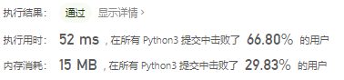

# [40. 组合总和 II](https://leetcode-cn.com/problems/combination-sum-ii/)

给定一个数组 `candidates` 和一个目标数 `target` ，找出 `candidates` 中所有可以使数字和为 `target` 的组合。

`candidates` 中的每个数字在每个组合中只能使用一次。

**说明：**

- 所有数字（包括目标数）都是正整数。
- 解集不能包含重复的组合。 

示例 1:

```
输入: candidates = [10,1,2,7,6,1,5], target = 8,
所求解集为:
[
  [1, 7],
  [1, 2, 5],
  [2, 6],
  [1, 1, 6]
]
```


示例 2:

```
输入: candidates = [2,5,2,1,2], target = 5,
所求解集为:
[
  [1,2,2],
  [5]
]
```

## 思路

这道题与上一道题不同的是多了不能重复使用元素这一条件，所以改动了上一个题目中的递归函数，每次递归的时候往前走一位，意味着这个元素不会在经历下一次计算。

并且这里需要考虑一个条件，在整个列表总和不超过target时直接返回空列表。这样就解决了元素总和不够但还会遍历列表依次相加的问题。

```python
class Solution:
    def combinationSum2(self, candidates: List[int], target: int) -> List[List[int]]:
        res = []
        candidates = sorted(candidates)
        if sum(candidates) < target:
            return res

        def dfs(s, m, target):
            for i in range(s, len(candidates)):
                tmp = candidates[i]
                if tmp == target and m + [tmp] not in res:
                    res.append(m + [tmp])
                elif tmp < target:
                    dfs(i + 1, m + [tmp], target - tmp)
                else:
                    return

        dfs(0, [], target)
        return res
```



### 参考题解

首先看了一下提交记录中用时最少的代码。（有问题，没明白）

1. 首先将candidates进行排序，size为candidates长度
2. dfs中参数 candidates为源列表，size表示源列表长度，begin为起始索引，target为目标长度，path为每次的list，res为结果list
3. 

```python
class Solution:
    def combinationSum2(self, candidates: List[int], target: int) -> List[List[int]]:
        def dfs(candidates, size, begin, target, path, res):
            if target == 0:
                res.append(path[:]) 
                return
            
            for i in range(begin, size):
                if target-candidates[i]<0:
                    break
                if i > begin and candidates[i]==candidates[i-1]:
                    continue # 这里是为了限定不为空而考虑的
                path.append(candidates[i])
                dfs(candidates, size, i+1, target-candidates[i], path, res)
                path.pop()


        candidates.sort()
        size = len(candidates)
        path = []
        res = []
        dfs(candidates, size, 0, target, path, res)
        return res
```


```python
from typing import List


class Solution:

    def combinationSum2(self, candidates: List[int], target: int) -> List[List[int]]:
        def dfs(begin, path, residue):
            if residue == 0:
                res.append(path[:])
                return

            for index in range(begin, size):
                if candidates[index] > residue:
                    break

                if index > begin and candidates[index - 1] == candidates[index]:
                    continue

                path.append(candidates[index])
                dfs(index + 1, path, residue - candidates[index])
                path.pop()

        size = len(candidates)
        if size == 0:
            return []

        candidates.sort()
        res = []
        dfs(0, [], target)
        return res
```

