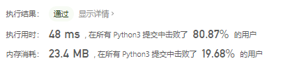
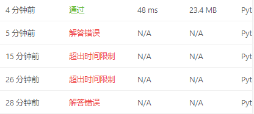
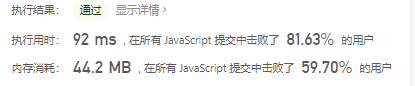
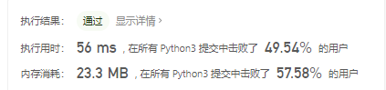

# [剑指 Offer 03. 数组中重复的数字](https://leetcode-cn.com/problems/shu-zu-zhong-zhong-fu-de-shu-zi-lcof/)

找出数组中重复的数字。


在一个长度为 n 的数组 nums 里的所有数字都在 0～n-1 的范围内。数组中某些数字是重复的，但不知道有几个数字重复了，也不知道每个数字重复了几次。请找出数组中任意一个重复的数字。

示例 1：

```
输入：
[2, 3, 1, 0, 2, 5, 3]
输出：2 或 3 
```

## 思路

暴力穷举（会超限）

```python
class Solution:
    def findRepeatNumber(self, nums: List[int]) -> int:
        right, left = 1, 0
        while left < len(nums)-1:
            if nums[right] == nums[left]:
                return nums[right]
            right += 1
            if right == len(nums):
                left += 1
                right = left + 1
```

降了半个复杂度还是会超限

```python
class Solution:
    def findRepeatNumber(self, nums: List[int]) -> int:
        for i in nums:
            if nums.count(i) > 1:
                return i
```

然后想了个办法空间换时间

```python
class Solution:
    def findRepeatNumber(self, nums: List[int]) -> int:
        res = [0] * len(nums)
        for i in nums:
            res[i] += 1
            if res[i] > 1:
                return i
```





超限两次，笔误两次

js实现

```JavaScript
var findRepeatNumber = function(nums) {
    let res = new Array(nums.length);
    for(let i=0; i<nums.length;i++){
        if(res[nums[i]]===undefined){
            res[nums[i]] = 1;
            continue;
        }
        res[nums[i]] += 1;
        if(res[nums[i]] > 1){
            return nums[i]
        }
    }
};
```



参考题解，原地置换

```python
class Solution:
    def findRepeatNumber(self, nums: List[int]) -> int:
        for i in range(len(nums)):
            while nums[i]!=i:
                if nums[i]==nums[nums[i]]:
                    return nums[i]
                temp = nums[i]
                nums[i]=nums[temp]
                nums[temp] = temp

        return -1
```



在原数组中进行排序，如果出现不等的情况那就说明有重复的元素出现，原地置换。节省了空间，但是时间复杂度略高一点但空间复杂度O(1).

#### 排序

```python
class Solution(object):
    def findRepeatNumber(self, nums):
        """
        :type nums: List[int]
        :rtype: int
        """
        nums.sort()
        pre = nums[0]
        for index in range(1, len(nums)):
            if pre == nums[index]:
                return pre
            pre = nums[index]
```

- 时间复杂度`O(nlogn)`,空间复杂度`O(1)`

#### 哈希表

```python
class Solution(object):
    def findRepeatNumber(self, nums):
        """
        :type nums: List[int]
        :rtype: int
        """

        dic = {}
        for i in nums:
            if i not in dic:
                dic[i] = 0
            else:
                return i
```

- 时间复杂度`O(n)`,空间复杂度`O(n)`

#### 下标定位

```python
class Solution(object):
    def findRepeatNumber(self, nums):
        """
        :type nums: List[int]
        :rtype: int
        """
        for i in range(len(nums)):
            while nums[i] != i:
                if nums[nums[i]] == nums[i]:
                    return nums[i]
                nums[nums[i]] , nums[i] = nums[i] , nums[nums[i]]
        
        return None

```

- 时间复杂度`O(n)`均摊,空间复杂度`O(1)`