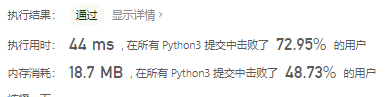
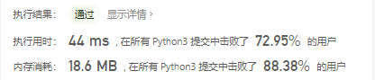
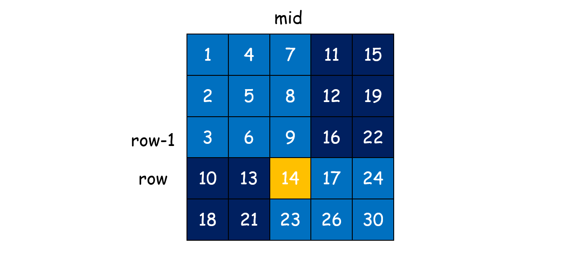
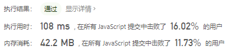

# [剑指 Offer 04. 二维数组中的查找](https://leetcode-cn.com/problems/er-wei-shu-zu-zhong-de-cha-zhao-lcof/)

在一个 n * m 的二维数组中，每一行都按照从左到右递增的顺序排序，每一列都按照从上到下递增的顺序排序。请完成一个高效的函数，输入这样的一个二维数组和一个整数，判断数组中是否含有该整数。

 

示例:

```
现有矩阵 matrix 如下：

[
  [1,   4,  7, 11, 15],
  [2,   5,  8, 12, 19],
  [3,   6,  9, 16, 22],
  [10, 13, 14, 17, 24],
  [18, 21, 23, 26, 30]
]
```


给定 target = 5，返回 true。

给定 target = 20，返回 false。

 

限制：

- 0 <= n <= 1000

- 0 <= m <= 1000

 

注意：本题与主站 240 题相同：https://leetcode-cn.com/problems/search-a-2d-matrix-ii/

## 思路

首先想到的是暴力穷举但是需要注意这道题给定的一个特殊条件，即同列和同行都存在递增关系。

不过这道题的数据比较小，遍历的方法还可以

```python
class Solution:
    def findNumberIn2DArray(self, matrix: List[List[int]], target: int) -> bool:
        for i in range(len(matrix)):
            for j in range(len(matrix[0])):
                if matrix[i][j] == target:
                    return True
        return False
```




然后使用python的机制，再加上剪枝思路

```python
class Solution:
    def findNumberIn2DArray(self, matrix: List[List[int]], target: int) -> bool:
        if not matrix or not matrix[0]:
            return False
        for i in range(len(matrix)):
            if target > max(matrix[i]):
                continue
            if target in matrix[i]:
                return True
            elif i == len(matrix) - 1:
                return False
        return False
```



参考题解

```python
class Solution:
    def findNumberIn2DArray(self, matrix: List[List[int]], target: int) -> bool:
        i, j = len(matrix) - 1, 0
        while i >= 0 and j < len(matrix[0]):
            if matrix[i][j] > target: i -= 1
            elif matrix[i][j] < target: j += 1
            else: return True
        return False
```


#### 二分搜索

> [图解 找规律+二分查找+递归 - 二维数组中的查找 - 力扣（LeetCode） (leetcode-cn.com)](https://leetcode-cn.com/problems/er-wei-shu-zu-zhong-de-cha-zhao-lcof/solution/gao-su-jie-fa-qing-xi-tu-jie-by-ml-zimingmeng/)

```python
class Solution:
    def binary_search(self, matrix, target, start, vertical):
        lo = start
        hi = len(matrix) - 1 if vertical else len(matrix[0]) - 1 # 垂直搜索：hi = 行数 - 1

        while lo <= hi:
            mid = (lo + hi) // 2
            if vertical:  # 垂直搜索
                if matrix[mid][start] < target:
                    lo = mid + 1
                elif matrix[mid][start] > target:
                    hi = mid - 1
                else: 
                    return True
            else:   # 水平搜索
                if matrix[start][mid] < target:
                    lo = mid + 1
                elif matrix[start][mid] > target:
                    hi = mid - 1
                else:
                    return True

        return False

    def findNumberIn2DArray(self, matrix: List[List[int]], target: int) -> bool:
        if not matrix: return False   # 边界条件

        for i in range(min(len(matrix), len(matrix[0]))):
            vertical_found = self.binary_search(matrix, target, i, True) # 垂直方向是否找到
            horizontal_found = self.binary_search(matrix, target, i, False) # 水平是否找到
            if vertical_found or horizontal_found:  # 任一方向找到即可
                return True

        return False
```

#### 递归

在 mid 列寻找满足条件 matrix\[row - 1][mid]<target<matrix\[row][mid]matrix\[row−1][mid]<target<matrix\[row][mid] 的点，比如当 row=3,mid=2r 时（黄色区域），9<target<14，这时我们可以判断出来 target一定在左下或者右上区域：

由 target>9t，可知 target 在 9 的右侧或下侧；
由 target<14，可知 target 在 14 的上侧或左侧；
因此对左下和右上两个区域进行递归，直到遇到终止条件进行回溯，返回结果。 终止条件为：

- 区域中没有元素；
- target大于深色区域右下角的值（最大值）或小于深色区域左上角的值（最小值）
  其中，找到黄色点的方法如下：

1. 列索引 mid 采用二分查找;
2. 行索引沿 mid 列从上向下移动，并保持该位置元素小于 target。




```python
class Solution:
    def findNumberIn2DArray(self, matrix: List[List[int]], target: int) -> bool:
        if not matrix: return False


    def search_backtrack(left, up, right, down):
        if left > right or up > down:
            return False
        elif target < matrix[up][left] or target > matrix[down][right]:
            return False

        mid = left + (right - left) // 2

        row = up
        while row <= down and matrix[row][mid] <= target:
            if matrix[row][mid] == target:
                return True
            row += 1

        return search_backtrack(left, row, mid - 1, down) or search_backtrack(mid + 1, up, right, row - 1)

    return search_backtrack(0, 0, len(matrix[0]) - 1, len(matrix) - 1)
```

js 一行代码

```javascript
var findNumberIn2DArray = function(matrix, target) {
    return matrix.flat(Infinity).includes(target)
};
```



flat(Infinity)可以直接拍平，然后判断包不包含target