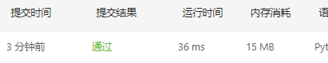
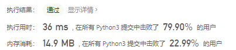
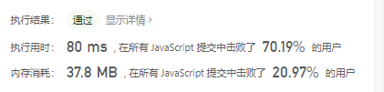

# [剑指 Offer 05. 替换空格](https://leetcode-cn.com/problems/ti-huan-kong-ge-lcof/)

请实现一个函数，把字符串 `s` 中的每个空格替换成"%20"。

 

**示例 1：**

```
输入：s = "We are happy."
输出："We%20are%20happy."
```

 

**限制：**

```
0 <= s 的长度 <= 10000
```

##  思路

就找空格，然后替换成空格，第一个简单的方法就是调用replace函数，将所有的空格替换成%20，代码如下：

```python
class Solution:
    def replaceSpace(self, s: str) -> str:
        s = s.replace(' ', '%20')
        return s
```



换个正常实现的思路，利用while循环找到空字符然后替换它

```python
class Solution:
    def replaceSpace(self, s: str) -> str:
        i = 0
        while ' ' in s:
            if s[i] == ' ':
                s = s[:i]+'%20'+s[i+1:]
            i += 1
        return s
```



利用其它list，空间换时间

```python
class Solution:
    def replaceSpace(self, s: str) -> str:
        list = []
        word = ""
        for i in s:
            if i != " ":
                word += i
            else:
                list.append(word)
                list.append('%20')
                word = ""
        if word:
            list.append(word)
        return "".join(list)
```


js代码：

```JavaScript
/**
 * @param {string} s
 * @return {string}
 */
var replaceSpace = function(s) {
    s = s.replace(/ /g,"%20")
    return s
};
```

