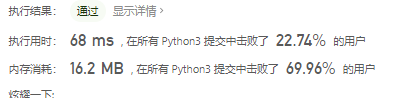
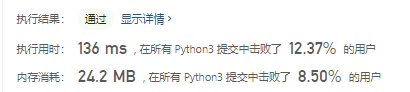
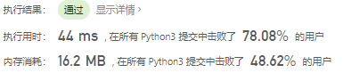

# [剑指 Offer 06. 从尾到头打印链表](https://leetcode-cn.com/problems/cong-wei-dao-tou-da-yin-lian-biao-lcof/)


输入一个链表的头节点，从尾到头反过来返回每个节点的值（用数组返回）。

 

**示例 1：**

```
输入：head = [1,3,2]
输出：[2,3,1]
```

 

**限制：**

```
0 <= 链表长度 <= 10000
```

# 思路

头插改尾插，采用insert方法

```python
# Definition for singly-linked list.
class ListNode:
    def __init__(self, x):
        self.val = x
        self.next = None


class Solution:
    def reversePrint(self, head: ListNode) -> List[int]:
        res = []
        for i in range(1, len(head)):
            temp = ListNode(head[i])
            p = l
            while p.next:
                p = p.next
            p.next = temp
        p = l
        while p:
            res.insert(0, p.val)
            p = p.next
        return res
```



## 参考题解

递推阶段： 每次传入 head.next ，以 head == None（即走过链表尾部节点）为递归终止条件，此时返回空列表 [] 。
回溯阶段： 利用 Python 语言特性，递归回溯时每次返回 当前 list + 当前节点值 [head.val] ，即可实现节点的倒序输出。

```python
class Solution:
    def reversePrint(self, head: ListNode) -> List[int]:
        return self.reversePrint(head.next) + [head.val] if head else []
```



- **时间复杂度 *O*(*N*)：** 遍历链表，递归N次。
- **空间复杂度 *O*(*N*)：** 系统递归需要使用 O*(*N*) 的栈空间。

```python
class Solution:
    def reversePrint(self, head: ListNode) -> List[int]:
        stack = []
        while head:
            stack.append(head.val)
            head = head.next
        return stack[::-1]
```

