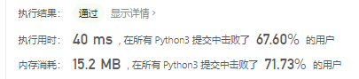
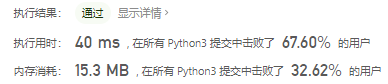
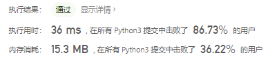
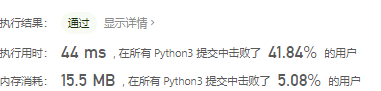
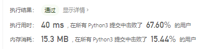

# [剑指 Offer 11. 旋转数组的最小数字](https://leetcode-cn.com/problems/xuan-zhuan-shu-zu-de-zui-xiao-shu-zi-lcof/)

把一个数组最开始的若干个元素搬到数组的末尾，我们称之为数组的旋转。输入一个递增排序的数组的一个旋转，输出旋转数组的最小元素。例如，数组 `[3,4,5,1,2]` 为 `[1,2,3,4,5]` 的一个旋转，该数组的最小值为1。 

**示例 1：**

```
输入：[3,4,5,1,2]
输出：1
```

**示例 2：**

```
输入：[2,2,2,0,1]
输出：0
```

注意：本题与主站 154 题相同：https://leetcode-cn.com/problems/find-minimum-in-rotated-sorted-array-ii/

# 思路

- 找到左侧比右侧小的第一个数
- 二分查找
- 返回最小值

```python
class Solution:
    def minArray(self, numbers: List[int]) -> int:
        left = 0
        right = len(numbers) - 1
        while (right - left) > 1:
            if numbers[int(left)] >= numbers[int(right)]:
                left += 1
            else:
                right = math.ceil((right + left) / 2)
        return min(numbers[int(left)], numbers[int(right)])
```



排序然后返回第一个数

```python
class Solution:
    def minArray(self, numbers: List[int]) -> int:
        numbers.sort()
        return numbers[0]
```



直接找最小值

```python
class Solution:
    def minArray(self, numbers: List[int]) -> int:
        return min(numbers)
```



**题解参考**

```python
class Solution:
    def minArray(self, numbers: [int]) -> int:
        i, j = 0, len(numbers) - 1
        while i < j:
            m = (i + j) // 2
            if numbers[m] > numbers[j]: i = m + 1
            elif numbers[m] < numbers[j]: j = m
            else: return min(numbers[i:j])
        return numbers[i]
```



实际上，当出现 nums[m] = nums[j] 时，一定有区间 \[i, m] 内所有元素相等 或 区间 \[m, j]内所有元素相等（或两者皆满足）。对于寻找此类数组的最小值问题，可直接放弃二分查找，而使用线性查找替代。

```python
class Solution:
    def minArray(self, numbers: [int]) -> int:
        i, j = 0, len(numbers) - 1
        while i < j:
            m = (i + j) // 2
            if numbers[m] > numbers[j]: i = m + 1
            elif numbers[m] < numbers[j]: j = m
            else: j -= 1
        return numbers[i]
```

