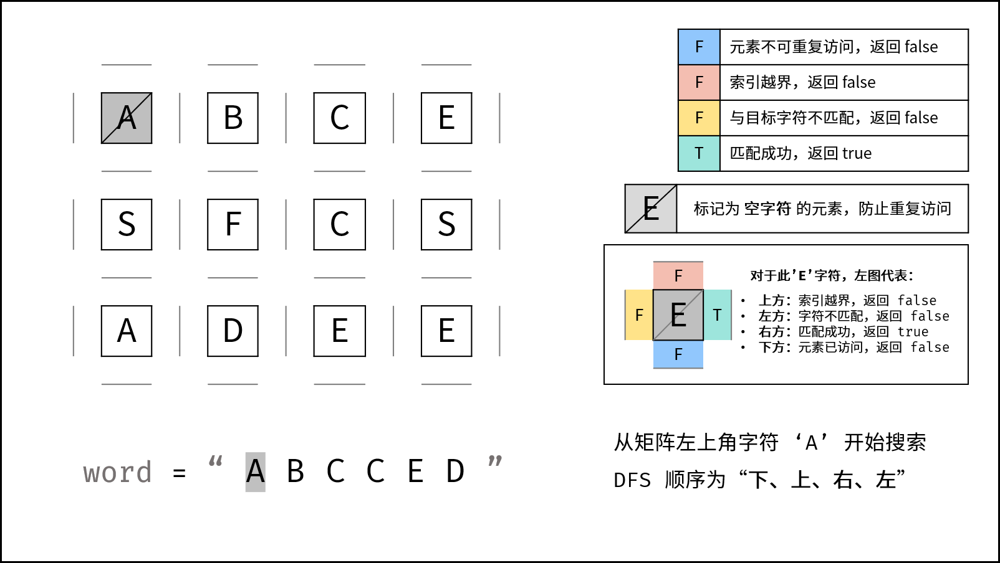
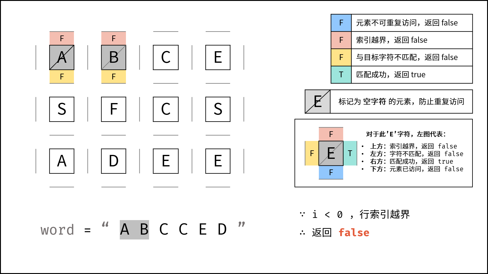
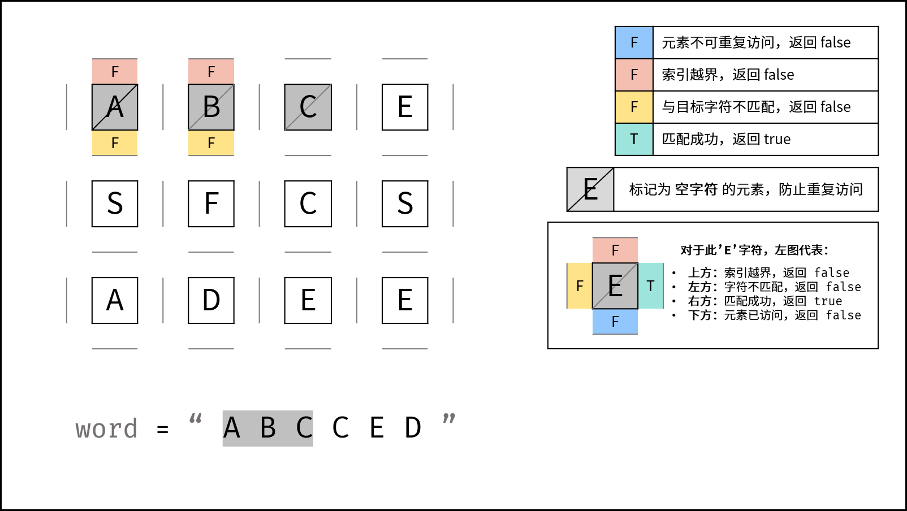
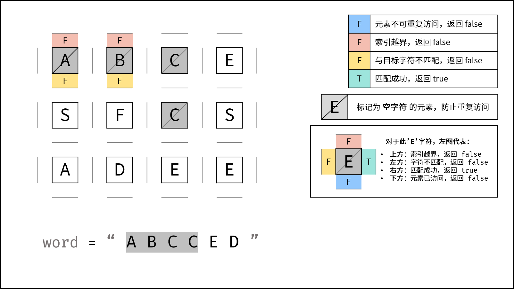
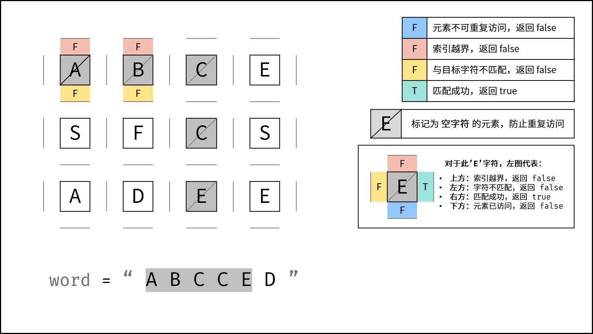
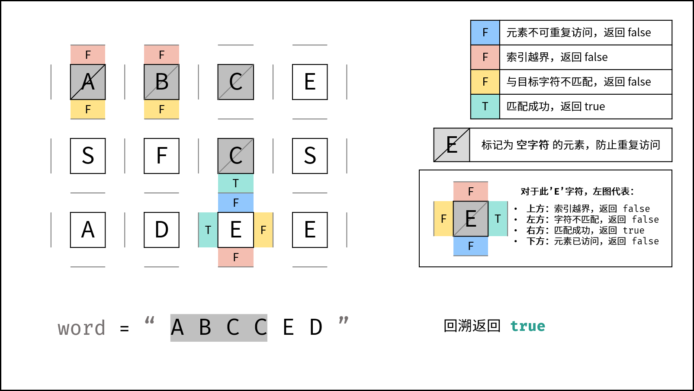
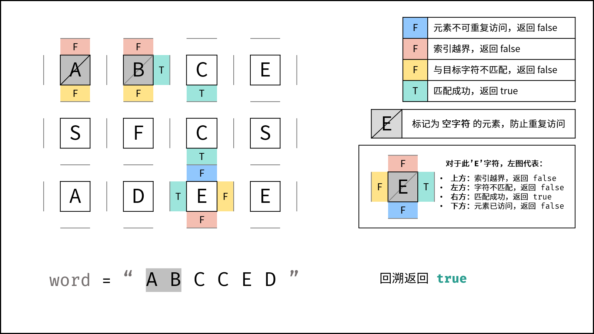
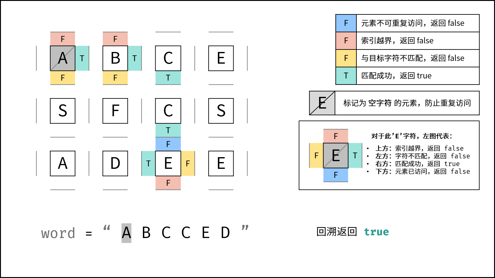

# [剑指 Offer 12. 矩阵中的路径](https://leetcode-cn.com/problems/ju-zhen-zhong-de-lu-jing-lcof/)

### <u>需要回看</u>

请设计一个函数，用来判断在一个矩阵中是否存在一条包含某字符串所有字符的路径。路径可以从矩阵中的任意一格开始，每一步可以在矩阵中向左、右、上、下移动一格。如果一条路径经过了矩阵的某一格，那么该路径不能再次进入该格子。例如，在下面的3×4的矩阵中包含一条字符串“bfce”的路径（路径中的字母用加粗标出）。

[["a","**b**","c","e"],
["s","**f**","**c**","s"],
["a","d","**e**","e"]]

但矩阵中不包含字符串“abfb”的路径，因为字符串的第一个字符b占据了矩阵中的第一行第二个格子之后，路径不能再次进入这个格子。

 

**示例 1：**

```
输入：board = [["A","B","C","E"],["S","F","C","S"],["A","D","E","E"]], word = "ABCCED"
输出：true
```

**示例 2：**

```
输入：board = [["a","b"],["c","d"]], word = "abcd"
输出：false
```

 

**提示：**

- `1 <= board.length <= 200`
- `1 <= board[i].length <= 200`

## 思路

没想出来，查看题解

**[深度优先搜索（DFS）+剪枝](https://leetcode-cn.com/problems/ju-zhen-zhong-de-lu-jing-lcof/solution/mian-shi-ti-12-ju-zhen-zhong-de-lu-jing-shen-du-yo/)**解决

- 深度优先搜索：遍历矩阵中所有字符串可能性。DFS通过递归，先朝一个方向搜到底，再回溯到上一个节点，沿另一个方向搜索，以此类推
- 剪枝：如果遇到这条路不可能和目标字符串匹配成功的情况（例如：此矩阵元素和目标字符不同，此元素已被访问），则立即返回，称为可行性剪枝


**DFS 解析：**
递归参数： 当前元素在矩阵 board 中的行列索引 i 和 j ，当前目标字符在 word 中的索引 k 。
**终止条件：**

1. 返回 false ： (1) 行或列索引越界 或 (2) 当前矩阵元素与目标字符不同 或 (3) 当前矩阵元素已访问过 （ (3) 可合并至 (2) ） 。

2. 返回 true ： k = len(word) - 1 ，即字符串 word 已全部匹配。

- 递推工作：
  1. 标记当前矩阵元素： 将 board\[i][j] 修改为 空字符 '' ，代表此元素已访问过，防止之后搜索时重复访问。
  2. 搜索下一单元格： 朝当前元素的 上、下、左、右 四个方向开启下层递归，使用 或 连接 （代表只需找到一条可行路径就直接返回，不再做后续 DFS ），并记录结果至 res 。
  3. 还原当前矩阵元素： 将 board\[i][j] 元素还原至初始值，即 word[k] 。

- 返回值： 返回布尔量 res ，代表是否搜索到目标字符串。

> 使用空字符（Python: '' , Java/C++: '\0' ）做标记是为了防止标记字符与矩阵原有字符重复。当存在重复时，此算法会将矩阵原有字符认作标记字符，从而出现错误。





















**复杂度分析：**

> M, N 分别为矩阵行列大小， K 为字符串 word 长度。

- 时间复杂度 $O(3^KMN)$： 最差情况下，需要遍历矩阵中长度为 KK 字符串的所有方案，时间复杂度为$O(3^K)$；矩阵中共有 MN 个起点，时间复杂度为 $O(MN)$。
  - 方案数计算： 设字符串长度为 K，搜索中每个字符有上、下、左、右四个方向可以选择，舍弃回头（上个字符）的方向，剩下 3 种选择，因此方案数的复杂度为 $O(3^K)$。

- 空间复杂度 O(K)： 搜索过程中的递归深度不超过 K ，因此系统因函数调用累计使用的栈空间占用 O(K)（因为函数返回后，系统调用的栈空间会释放）。最坏情况下 K = MN ，递归深度为 MN，此时系统栈使用 O(MN) 的额外空间。

```python
class Solution:
    def exist(self, board: List[List[str]], word: str) -> bool:
        def dfs(i, j, k):
            if not 0 <= i < len(board) or not 0 <= j < len(board[0]) or board[i][j] != word[k]: return False
            if k == len(word) - 1: return True
            board[i][j] = ''
            res = dfs(i + 1, j, k + 1) or dfs(i - 1, j, k + 1) or dfs(i, j + 1, k + 1) or dfs(i, j - 1, k + 1)
            board[i][j] = word[k]
            return res

        for i in range(len(board)):
            for j in range(len(board[0])):
                if dfs(i, j, 0): return True
        return False
```