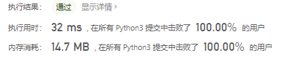

# [🏆 LCCUP ‘21 力扣杯春季编程大赛 - 个人赛](https://leetcode-cn.com/contest/season/2021-spring/)


清明节假期的结尾参加了这个编程大赛试了一试，果然是不一样，看到第一题之后觉得很简单，洒洒水，但还是修bug修了一会儿。

然后第二题的乐团占位，怎么看怎么像螺旋矩阵那个题，就被陷入了螺旋矩阵的怪圈，时间复杂度一直是$O(n^2)$。

第三题的魔塔考虑的情况少了，没有通过

第四题和第五题直接放弃。

看了一下前500名的话是做出来三道题就可以，这样看的话还可以。

## `2 分` - [采购方案](https://leetcode-cn.com/problems/4xy4Wx/)

#### [LCP 28. 采购方案](https://leetcode-cn.com/problems/4xy4Wx/)

难度简单14

小力将 N 个零件的报价存于数组 `nums`。小力预算为 `target`，假定小力仅购买两个零件，要求购买零件的花费不超过预算，请问他有多少种采购方案。

注意：答案需要以 `1e9 + 7 (1000000007)` 为底取模，如：计算初始结果为：`1000000008`，请返回 `1`

**示例 1：**

> 输入：`nums = [2,5,3,5], target = 6`
>
> 输出：`1`
>
> 解释：预算内仅能购买 nums[0] 与 nums[2]。

**示例 2：**

> 输入：`nums = [2,2,1,9], target = 10`
>
> 输出：`4`
>
> 解释：符合预算的采购方案如下：
> nums[0] + nums[1] = 4
> nums[0] + nums[2] = 3
> nums[1] + nums[2] = 3
> nums[2] + nums[3] = 10

**提示：**

- `2 <= nums.length <= 10^5`
- `1 <= nums[i], target <= 10^5`

### 思路

最开始是想暴力穷举，但是时间超限了，改用双指针

```python
class Solution:
    def purchasePlans(self, nums: List[int], target: int) -> int:
        nums = sorted(nums)
        length = len(nums)
        res = 0
        left, right = 0, length - 1
        while left < right:
            if nums[left] + nums[right] > target:
                right -= 1
            else:
                res += right - left
                left += 1

        return res % 1000000007
```


---------------------------------------------------

## `4 分` - [乐团站位](https://leetcode-cn.com/problems/SNJvJP/)

#### [LCP 29. 乐团站位](https://leetcode-cn.com/problems/SNJvJP/)

难度简单16

某乐团的演出场地可视作 `num * num` 的二维矩阵 `grid`（左上角坐标为 `[0,0]`)，每个位置站有一位成员。乐团共有 `9` 种乐器，乐器编号为 `1~9`，每位成员持有 `1` 个乐器。

为保证声乐混合效果，成员站位规则为：自 `grid` 左上角开始顺时针螺旋形向内循环以 `1，2，...，9` 循环重复排列。例如当 num = `5` 时，站位如图所示


请返回位于场地坐标 [`Xpos`,`Ypos`] 的成员所持乐器编号。

**示例 1：**

> 输入：`num = 3, Xpos = 0, Ypos = 2`
>
> 输出：`3`
>
> 解释：
> 

**示例 2：**

> 输入：`num = 4, Xpos = 1, Ypos = 2`
>
> 输出：`5`
>
> 解释：
> 

**提示：**

- `1 <= num <= 10^9`
- `0 <= Xpos, Ypos < num`

### 思路

本来是想构建螺旋矩阵之后再找对应的元素的，但是这样时间复杂度过高。

```python
class Solution:
    def orchestraLayout(self, num: int, xPos: int, yPos: int) -> int:
        layer = min([xPos, num - xPos - 1, yPos, num - yPos - 1])  # 位于第几圈，x,y距离边界最近的数就是外面的层数
        v = (num*layer*4 - layer*layer*4) % 9  # 前几圈有多少个元素

        start, end = layer, num - layer

        if xPos == start:
            return (v + yPos - start) % 9 + 1

        if yPos == end - 1:
            return (v + end - start - 1 + xPos - start) % 9 + 1

        if xPos == end - 1:
            return (v + (end - start)*2 - 2 + end - yPos - 1) % 9 + 1

        if yPos == start:
            return (v + (end - start)*3 - 3 + end - xPos - 1) % 9 + 1

        return 0
```

不是很好理解

```python
def helper(n, k):
    # n 大小的矩阵, 外面 k 层的格子数目
    # 4*(n-1) + 4*(n-3) + ... + 4*(n-2k+1)
    # return 4 * (n-1 + n-2*k+1) * k /2
    return 4 * (n - k) * k % 9


class Solution:
    def orchestraLayout(self, n: int, x: int, y: int) -> int:
        # x,y 距离 4 个边界最近的就是外面的层数
        k = min(x, y, n - 1 - x, n - 1 - y)
        res = helper(n, k)
        up, down, left, right = k, n - 1 - k, k, n - 1 - k
        # 顺时针依次判断
        if x == up:
            res += y - left
        elif y == right:
            res += right - left + x - up
        elif x == down:
            res += right - left + down - up + (right - y)
        elif y == left:
            res += right - left + down - up + right - left + (down - x)
        return res % 9 + 1
```



-----------------------

## `6 分` - [魔塔游戏](https://leetcode-cn.com/problems/p0NxJO/)

#### [LCP 30. 魔塔游戏](https://leetcode-cn.com/problems/p0NxJO/)

难度中等7

小扣当前位于魔塔游戏第一层，共有 `N` 个房间，编号为 `0 ~ N-1`。每个房间的补血道具/怪物对于血量影响记于数组 `nums`，其中正数表示道具补血数值，即血量增加对应数值；负数表示怪物造成伤害值，即血量减少对应数值；`0` 表示房间对血量无影响。

**小扣初始血量为 1，且无上限**。假定小扣原计划按房间编号升序访问所有房间补血/打怪，**为保证血量始终为正值**，小扣需对房间访问顺序进行调整，**每次仅能将一个怪物房间（负数的房间）调整至访问顺序末尾**。请返回小扣最少需要调整几次，才能顺利访问所有房间。若调整顺序也无法访问完全部房间，请返回 -1。

**示例 1：**

> 输入：`nums = [100,100,100,-250,-60,-140,-50,-50,100,150]`
>
> 输出：`1`
>
> 解释：初始血量为 1。至少需要将 nums[3] 调整至访问顺序末尾以满足要求。

**示例 2：**

> 输入：`nums = [-200,-300,400,0]`
>
> 输出：`-1`
>
> 解释：调整访问顺序也无法完成全部房间的访问。

**提示：**

- `1 <= nums.length <= 10^5`
- `-10^5 <= nums[i] <= 10^5`

### 思路

使用优先队列

> **最大优先队列，无论入队顺序，当前最大的元素优先出队。**
>
> **最小优先队列，无论入队顺序，当前最小的元素优先出队。**

```python
class Solution:
    def magicTower(self, nums: List[int]) -> int:
        if sum(nums) < 0:
            return -1
        # 开始模拟
        hp = 1
        pq = []
        last = 0
        for i in range(len(nums)):
            if nums[i] < 0:	# 如果当前元素小于0，入队
                heapq.heappush(pq, nums[i])	
                if hp + nums[i] <= 0:	# 如果当前元素与hp相加小于等于0，last加1，出队返还生命值
                    last += 1
                    hp -= heapq.heappop(pq)  # 出队并返还生命值
            hp += nums[i]	# 砍怪或者吃血
        return last
```


## `8 分` - [变换的迷宫](https://leetcode-cn.com/problems/Db3wC1/)

#### [LCP 31. 变换的迷宫](https://leetcode-cn.com/problems/Db3wC1/)

难度困难8

某解密游戏中，有一个 N*M 的迷宫，迷宫地形会随时间变化而改变，迷宫出口一直位于 `(n-1,m-1)` 位置。迷宫变化规律记录于 `maze` 中，`maze[i]` 表示 `i` 时刻迷宫的地形状态，`"."` 表示可通行空地，`"#"` 表示陷阱。

地形图初始状态记作 `maze[0]`，此时小力位于起点 `(0,0)`。此后每一时刻可选择往上、下、左、右其一方向走一步，或者停留在原地。

小力背包有以下两个魔法卷轴（卷轴使用一次后消失）：

- 临时消除术：将指定位置在下一个时刻变为空地；
- 永久消除术：将指定位置永久变为空地。

请判断在迷宫变化结束前（含最后时刻），小力能否在不经过任意陷阱的情况下到达迷宫出口呢？

**注意： 输入数据保证起点和终点在所有时刻均为空地。**

**示例 1：**

> 输入：`maze = [[".#.","#.."],["...",".#."],[".##",".#."],["..#",".#."]]`
>
> 输出：`true`
>
> 解释：
> 

**示例 2：**

> 输入：`maze = [[".#.","..."],["...","..."]]`
>
> 输出：`false`
>
> 解释：由于时间不够，小力无法到达终点逃出迷宫。

**示例 3：**

> 输入：`maze = [["...","...","..."],[".##","###","##."],[".##","###","##."],[".##","###","##."],[".##","###","##."],[".##","###","##."],[".##","###","##."]]`
>
> 输出：`false`
>
> 解释：由于道路不通，小力无法到达终点逃出迷宫。

**提示：**

- `1 <= maze.length <= 100`
- `1 <= maze[i].length, maze[i][j].length <= 50`
- `maze[i][j]` 仅包含 `"."`、`"#"`

---------------------------

## `10 分` - [批量处理任务](https://leetcode-cn.com/problems/t3fKg1/)

#### [LCP 32. 批量处理任务](https://leetcode-cn.com/problems/t3fKg1/)

难度困难7

某实验室计算机待处理任务以 `[start,end,period]` 格式记于二维数组 `tasks`，表示完成该任务的时间范围为起始时间 `start` 至结束时间 `end` 之间，需要计算机投入 `period` 的时长，注意：

1. `period` 可为不连续时间
2. 首尾时间均包含在内

处于开机状态的计算机可同时处理任意多个任务，请返回电脑最少开机多久，可处理完所有任务。

**示例 1：**

> 输入：`tasks = [[1,3,2],[2,5,3],[5,6,2]]`
>
> 输出：`4`
>
> 解释：
> tasks[0] 选择时间点 2、3；
> tasks[1] 选择时间点 2、3、5；
> tasks[2] 选择时间点 5、6；
> 因此计算机仅需在时间点 2、3、5、6 四个时刻保持开机即可完成任务。

**示例 2：**

> 输入：`tasks = [[2,3,1],[5,5,1],[5,6,2]]`
>
> 输出：`3`
>
> 解释：
> tasks[0] 选择时间点 2 或 3；
> tasks[1] 选择时间点 5；
> tasks[2] 选择时间点 5、6；
> 因此计算机仅需在时间点 2、5、6 或 3、5、6 三个时刻保持开机即可完成任务。

**提示：**

- `2 <= tasks.length <= 10^5`
- `tasks[i].length == 3`
- `0 <= tasks[i][0] <= tasks[i][1] <= 10^9`
- `1 <= tasks[i][2] <= tasks[i][1]-tasks[i][0] + 1`