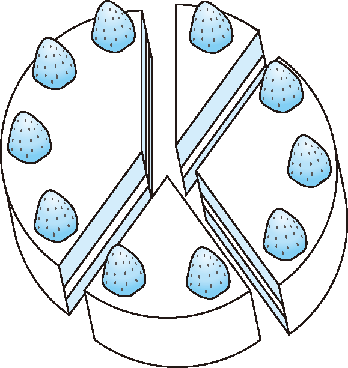

# Q18 水果酥饼日

IQ：90　目标时间：25 分钟
日本每月的 22 日是水果酥饼日。因为看日历的时候，22 日的上方刚好是 15 日，也就是“‘22’ 这个数字上面点缀着草莓”[1]

切分酥饼的时候，要求切分后每一块上面的草莓个数都不相同。假设切分出来的 N 块酥饼上要各有“1~N 个（共 N(N + 1)÷2 个草莓）”。

但这里要追加一个条件，那就是“一定要使相邻的两块酥饼上的数字之和是平方数”。

举个例子，假设 N ＝ 4 时采用如 图 4 的切法。这时，虽然 1 + 3 ＝ 4 得到的是平方数，但“1 和 4” “2 和 3” “2 和 4”的部分都不满足条件（图 4）。



<center>
    图 不满足条件的切法示例
</center>

`单选题`求可以使切法满足条件的最小的 N（N ＞ 1）。

A.32

B.16

C.48

D.64

`答案` 正确答案是 A

## 思路

拆分后的酥饼是围成圆形的，首先固定最开始的一块酥饼，并假设这块酥饼上的草莓个数为1。由于其他切法都可以通过旋转酥饼得到，所以这个假设的前提是成立的。

然后顺时针分配放置的草莓个数，保证每次放置的草莓个数都符合条件，直到最后一块上的数字和最初的1相加也得平方数。 

原书中采用Ruby语言实现，代码如下：

```ruby
def check(n, pre, log, square)
    if n == log.size then
        # 全部放置结束
        if square.include?(1 + pre) then
            # 1 和最后一个数之和为平方数时
            puts n
            p log
            return true # 只要找到1 种解法就结束
        end
    else
        ((1..n).to_a - log).each{|i| # 遍历没有被使用的数字
            if square.include?(pre + i) then
                # 如果和前一个数之和为平方数
                return true if check(n, i, log + [i], square)
            end
        }
    end
	false
end
	
n = 2
while true do
    # 事先计算平方数（最大值为n 的2 倍）
    square = (2..Math.sqrt(n * 2).floor).map{|i| i ** 2}
    break if check(n, 1, [1], square)
    n += 1
end
```

该问题可使用递归编写，使得整个代码更加简洁。代码如下：

```ruby
def check(last_n, used, list)
    # 已经全部使用，如果和最初的1 相加能得到平方数，则结束递归
    return [1] if used.all? && (list[1].include?(last_n))
    list[last_n].each{|i|           # 逐一尝试候补数字
        if used[i - 1] == false then  # 没有全部使用的情况
            used[i - 1] = true
            result = check(i, used, list)
            # 找到的时候，添加这个值
            return [i] + result if result.size > 0
            used[i - 1] = false
        end
    }
    []
end
	
n = 2
while true do
    square = (2..Math.sqrt(n * 2).floor).map{|i| i ** 2}
    # 找到可以作为相邻数字的候补数字
    list = {}
    (1..n).each{|i|
        list[i] = square.map{|s| s - i}.select{|s| s > 0}
    }
    # 把1 设置为已使用，从1 开始搜索
    result = check(1, [true] + [false] * (n - 1), list)
    break if result.size > 0
    n += 1
end
puts n
p result
```

不同的语言版本：

Java

```java
// 记录无向图
let edges = [];
// 记录搜索过程中每个数是否被使用过
let used = [];
// 记录搜索过程中的序列
const ans = [];
// 是否找到答案
let found = false;

const dfs = (pos, n) => {
    if (pos == n) {
        // 搜索完成，还需要判断首尾之和是否为完全平方数
        const sum = ans[0] + ans[ans.length - 1];
        const root = Math.floor(Math.sqrt(sum));
        if (root * root === sum) {
            found = true;
        }
    }
    else if (pos === 0) {
        // 由于酥饼是圆形，因此可以指定第一个数选择 1
        used[1] = true;
        ans.push(1);
        dfs(pos + 1, n);
        if (found) {
            return;
        }
        used[1] = false;
        ans.pop();
    }
    else {
        // 只能选与上一个数形成完全平方数，并且还未被选择的数
        for (const num of edges[ans[ans.length - 1]]) {
            if (!used[num]) {
                used[num] = true;
                ans.push(num);
                dfs(pos + 1, n);
                if (found) {
                    return;
                }
                used[num] = false;
                ans.pop();
            }
        }
    }
}

const minimalFruitPie = () => {
    // 从小到大枚举 n
    for (let n = 2; ; ++n) {
        edges = new Array(n + 1).fill(0).map(v => []);
        // 建立无向图
        for (let i = 1; i <= n; ++i) {
            // 枚举平方数 root^2
            for (let root = 1; root * root <= i + n; ++root) {
                const j = root * root - i;
                if (j > i) {
                    edges[i].push(j);
                    edges[j].push(i);
                }
            }
        }
        used = new Array(n + 1).fill(0);
        dfs(0, n);
        if (found) {
            return ans;
        }
    }
}
```

JavaScript

```javascript
// 记录无向图
let edges = [];
// 记录搜索过程中每个数是否被使用过
let used = [];
// 记录搜索过程中的序列
const ans = [];
// 是否找到答案
let found = false;

const dfs = (pos, n) => {
    if (pos == n) {
        // 搜索完成，还需要判断首尾之和是否为完全平方数
        const sum = ans[0] + ans[ans.length - 1];
        const root = Math.floor(Math.sqrt(sum));
        if (root * root === sum) {
            found = true;
        }
    }
    else if (pos === 0) {
        // 由于酥饼是圆形，因此可以指定第一个数选择 1
        used[1] = true;
        ans.push(1);
        dfs(pos + 1, n);
        if (found) {
            return;
        }
        used[1] = false;
        ans.pop();
    }
    else {
        // 只能选与上一个数形成完全平方数，并且还未被选择的数
        for (const num of edges[ans[ans.length - 1]]) {
            if (!used[num]) {
                used[num] = true;
                ans.push(num);
                dfs(pos + 1, n);
                if (found) {
                    return;
                }
                used[num] = false;
                ans.pop();
            }
        }
    }
}

const minimalFruitPie = () => {
    // 从小到大枚举 n
    for (let n = 2; ; ++n) {
        edges = new Array(n + 1).fill(0).map(v => []);
        // 建立无向图
        for (let i = 1; i <= n; ++i) {
            // 枚举平方数 root^2
            for (let root = 1; root * root <= i + n; ++root) {
                const j = root * root - i;
                if (j > i) {
                    edges[i].push(j);
                    edges[j].push(i);
                }
            }
        }
        used = new Array(n + 1).fill(0);
        dfs(0, n);
        if (found) {
            return ans;
        }
    }
}
```

Goland

```go
func minimalFruitPie() (ans []int) {
    for n := 2; ; n++ {
        graph := make([][]int, n+1)
        for i := 1; i <= n; i++ {
            for sqrt := 1; sqrt*sqrt-i <= n; sqrt++ {
                j := sqrt*sqrt - i
                if j > i {
                    graph[i] = append(graph[i], j)
                    graph[j] = append(graph[j], i)
                }
            }
        }

        used := make([]bool, n+1)
        var dfs func(int) bool
        dfs = func(pos int) bool {
            if pos == n {
                // 搜索完成，判断首尾之和是否为完全平方数
                sum := ans[0] + ans[len(ans)-1]
                sqrt := int(math.Sqrt(float64(sum)))
                return sqrt*sqrt == sum
            }
            if pos == 0 {
                // 指定第一个数选择 1
                used[1] = true
                ans = append(ans, 1)
                if dfs(pos + 1) {
                    return true
                }
                ans = ans[:len(ans)-1]
                used[1] = false
            } else {
                // 选与上一个数形成完全平方数，并且还未被选择的数
                for _, v := range graph[ans[len(ans)-1]] {
                    if used[v] {
                        continue
                    }
                    used[v] = true
                    ans = append(ans, v)
                    if dfs(pos + 1) {
                        return true
                    }
                    ans = ans[:len(ans)-1]
                    used[v] = false
                }
            }
            return false
        }
        if dfs(0) {
            return
        }
    }
}
```

C

```c
// 记录搜索过程中的序列
int *ans, ansSize;
// 是否找到答案
bool found;

void dfs(int pos, int n, int **edges, int *edgesColumSize, int *used) {
    if (pos == n) {
        // 搜索完成，还需要判断首尾之和是否为完全平方数
        int sum = ans[0] + ans[ansSize - 1];
        int root = sqrt(sum);
        if (root * root == sum) {
            found = true;
        }
    } else if (pos == 0) {
        // 由于酥饼是圆形，因此可以指定第一个数选择 1
        used[1] = true;
        ans[ansSize++] = 1;
        dfs(pos + 1, n, edges, edgesColumSize, used);
        if (found) {
            return;
        }
        used[1] = false;
        ansSize--;
    } else {
        // 只能选与上一个数形成完全平方数，并且还未被选择的数
        int x = ans[ansSize - 1];
        for (int i = 0; i < edgesColumSize[x]; i++) {
            int num = edges[x][i];
            if (!used[num]) {
                used[num] = true;
                ans[ansSize++] = num;
                dfs(pos + 1, n, edges, edgesColumSize, used);
                if (found) {
                    return;
                }
                used[num] = false;
                ansSize--;
            }
        }
    }
}

int *minimalFruitPie() {
    found = false;
    ans = NULL;
    // 从小到大枚举 n
    for (int n = 2;; ++n) {
        ansSize = 0;
        ans = realloc(ans, sizeof(int) * (n + 1));
        int *edges[n + 1];
        for (int i = 0; i <= n; ++i) {
            edges[i] = malloc(sizeof(int) * 200);
        }
        int edgesColumSize[n + 1];
        memset(edgesColumSize, 0, sizeof(edgesColumSize));
        // 建立无向图
        for (int i = 1; i <= n; ++i) {
            // 枚举平方数 root^2
            for (int root = 1; root * root <= i + n; ++root) {
                int j = root * root - i;
                if (j > i) {
                    edges[i][edgesColumSize[i]++] = j;
                    edges[j][edgesColumSize[j]++] = i;
                }
            }
        }
        int used[n + 1];
        memset(used, 0, sizeof(used));
        dfs(0, n, edges, edgesColumSize, used);
        for (int i = 0; i <= n; ++i) {
            free(edges[i]);
        }
        if (found) {
            return ans;
        }
    }
}
```


## python代码

```python
def checkValid(n, pre, arr, square):
    # 全部分割结束
    if n == len(arr):
        # 与第一块酥饼凑成平方数
        # 此时已经分成了预期的块数，所以只需验证即可
        if (1 + pre) in square:
            print(arr) # 输出分割方法
            return True
    else:
        for i in range(1, n + 1):
            # 按题意仅遍历没有被使用的数字
            if i in arr:
                '''如果i在arr中，则可以遍历下一个数字'''
                continue
            if ((i + pre) in square) and (checkValid(n, i, arr + [i], square)):
                '''此时验证i+前一个数值是否为平方数以及递归新的参数，新的参数为n,i,arr+[i],square，其中arr+[i]为向arr中传入新的值并进行递归'''
                return True
    return False

if __name__ == '__main__':
    n = 2
    while True:
        # 事先对于每一个 n 计算平方数集合
        square = [x * x for x in range(1, n)] # 构建平方数
        if checkValid(n, 1, [1], square):# 如果返回True，则跳出循环，否则增加分割块数。
            break
        n += 1
```

## 参考

1. [Leetcode Q18水果酥饼日](https://leetcode-cn.com/leetbook/read/interesting-algorithm-puzzles-for-programmers/97r135/)
2. [Leetcode官方](https://leetcode-cn.com/circle/discuss/amUE3E/view/cIvhGN/)
3. [Leetcode-章天杰](https://leetcode-cn.com/circle/discuss/amUE3E/view/OZEYiA/)

