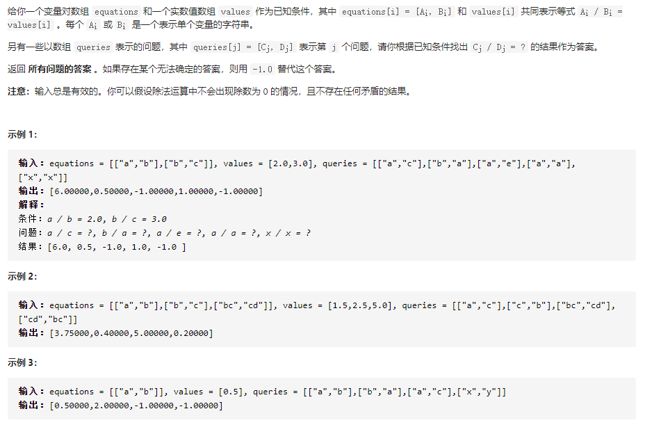

## 除法求值（中等）

问题描述：



#### 官解：广度优先搜索

```javascript
var equations = [["a","b"],["b","c"]];
var values = [2.0,3.0];
var queries = [["a","c"],["b","a"],["a","e"],["a","a"],["x","x"]];
calcEquation(equations, values, queries);
function calcEquation(equations, values, queries){
    let nvars = 0;
    const variables = new Map();

    // 获取equations中共有几个节点  (a,b,c)
    const n = equations.length;
    for (let i = 0; i < n; i++) {
        if (!variables.has(equations[i][0])) {
            variables.set(equations[i][0], nvars++);
        }
        if (!variables.has(equations[i][1])) {
            variables.set(equations[i][1], nvars++);
        }
    }
    // 以示例一为例：variables——>  Map { 'a' => 0, 'b' => 1, 'c' => 2 }

    // 对于每个节点，存储其直接连接到的所有节点及对应有向边的权值
    const edges = new Array(nvars).fill(0);     // [0,0,0]
    // [[],[],[]]——>equations中的元素，每个节点对应一个[]
    for (let i = 0; i < nvars; i++) {
        edges[i] = [];
    }
    for (let i = 0; i < n; i++) {
        const va = variables.get(equations[i][0]), vb = variables.get(equations[i][1]);
        edges[va].push([vb, values[i]]);
        edges[vb].push([va, 1.0 / values[i]]);
    }

    /***以示例1为例
     * edges[]=[[[1,2]],
     *          [[0,0.5],[2,3]],
     *          [[1,0.33]]]
     * edges[0]相当于与a相连的节点的集合，格式[[1,2]]
     * edges[0][0]里面的格式表示[a指向的节点在variables的索引值，边的权值]
     */

    const queriesCount = queries.length;
    const ret = [];
    for (let i = 0; i < queriesCount; i++) {
        // 获取query中每一对问题
        const query = queries[i];
        let result = -1.0;
        if (variables.has(query[0]) && variables.has(query[1])) {
            // ia和ib是索引值
            const ia = variables.get(query[0]), ib = variables.get(query[1]);
            if (ia === ib) {
                result = 1.0;
            } else {
                const points = [];
                points.push(ia);
                const ratios = new Array(nvars).fill(-1.0);         // [-1,-1,-1]
                ratios[ia] = 1.0;                          // [1,-1,-1]
                while (points.length && ratios[ib] < 0) {
                    const x = points.pop();
                    for (const [y, val] of edges[x]) {
                        if (ratios[y] < 0) {
                            ratios[y] = ratios[x] * val;
                            points.push(y);
                        }
                    }
                }
                result = ratios[ib];
            }
        }
        ret[i] = result;
    }
    console.log(ret);
}
```

