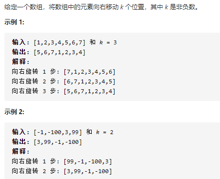
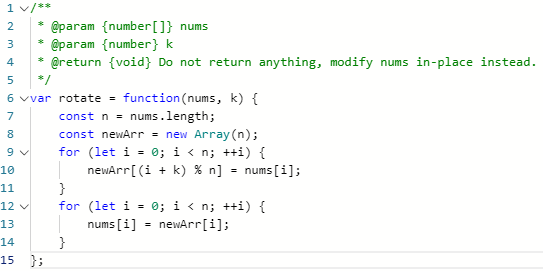

## 旋转数组

问题描述：



我的解：

方法一：

```javascript
var nums = [-1,-100,3,99];
// var nums = [1,2,3,4,5,6,7];
var k = 2;
result = rotate(nums, k);
console.log(result)
function rotate(nums, k) {
    var b = [];
    var p = nums.length - k;
    // 方法一：
    for (var i = 0; i < nums.length; i++){
         if (i >= p) {
             b[i + k - nums.length] = nums[i];
         }else {
             b[i + k] = nums[i];
         }
     }
     return b
}
```


方法二：

```javascript
var nums = [-1,-100,3,99];
// var nums = [1,2,3,4,5,6,7];
var k = 2;
result = rotate(nums, k);
console.log(result)
function rotate(nums, k) {
    var b = [];
    var p = nums.length - k;
    // 方法二：
    for (var i = 0; i < p; i++) {
        b[i + k] = nums[i];
    }
    for (var m = 0; m < k; m++,p++) {
        b[m] = nums[p];
    }
    return b
}
```

### 存在问题：当数组的长度小于k值时，则会报错。


#### 官解：

方法一：使用额外的数组

