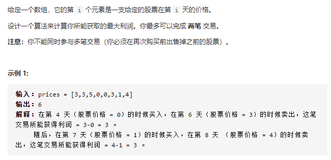

## 买卖股票的最佳时机

问题描述：



解题思路：

由于我们最多可以完成两笔交易，因此在任意一天结束之后，我们会处于以下五个状态中的一种：

- 未进行过任何操作；


- 只进行过一次买操作；


- 进行了一次买操作和一次卖操作，即完成了一笔交易；


- 在完成了一笔交易的前提下，进行了第二次买操作；


- 完成了全部两笔交易。


```javascript
var prices = [1,2,4,2,5,7,2,4,9,0] ;
var maxProfit = function(prices) {
    const n = prices.length;
    // 买入股票，利润为负，所以设为-prices[0]
    let buy1 = -prices[0], buy2 = -prices[0];
    let sell1 = 0, sell2 = 0;
    for (let i = 1; i < n; i++) {
         // 第一次买入的最大利润（低价买入，花费的钱最少，利润最大）
        buy1 = Math.max(buy1, -prices[i]);
        // 第一次卖出的最大利润（buy是买入，相当于负的利润；prices是当前价格卖出；两值相加，也就是第一次买入卖出的总利润）
        sell1 = Math.max(sell1, buy1 + prices[i]);
        // 第二次买入时的最大利润（用第一次买入卖出的总利润，减去第二次买入的价格，也就是当前的利润，与buy2进行比较，找到最大利润）
        buy2 = Math.max(buy2, sell1 - prices[i]);
        // 第二次卖出的最大利润（buy是买入，相当于负的利润；prices是当前价格卖出；两值相加，也就是两次买卖的总利润）
        sell2 = Math.max(sell2, buy2 + prices[i]);
    }
    return sell2;
};
console.log(maxProfit(prices));
```

