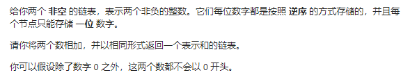
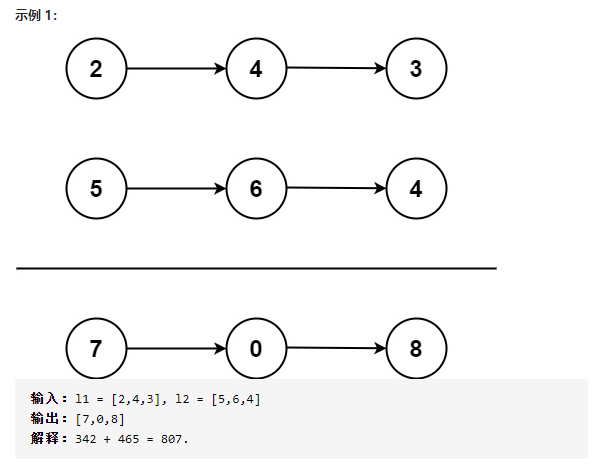

## 两数相加（中等）

问题描述





我的解：

```javascript
var l1 = [2,4,3];
var l2 = [5,6,4];
var addTwoNumbers = function(l1, l2) {
    let l = [];
    let num = 0,sum = 0,value = 0;
    let len = Math.max(l1.length, l2.length);
    for (let i = 0; i < len; i++) {
        if (l1[i] == null) {
            l1[i] = 0;
        }
        if (l2[i] == null) {
            l2[i] = 0;
        }
        sum = l1[i] + l2[i] +value;
        num = parseInt(sum/10);
        if (num !== 0) {
            sum = sum % 10;
            value = num;
            l.push(sum);
            if (value === num && l1[i+1] == null && l2[i+1] == null) {
                l.push(value);
            }
        }else {
            value = 0;
            l.push(sum);
        }

    }
    return l
};
console.log(addTwoNumbers(l1, l2));
```

​	**问题：审题不认真，按照数组来做的**

#### 官解：

```javascript
/**
 * Definition for singly-linked list.
 * function ListNode(val, next) {
 *     this.val = (val===undefined ? 0 : val)
 *     this.next = (next===undefined ? null : next)
 * }
 */
/**
 * @param {ListNode} l1
 * @param {ListNode} l2
 * @return {ListNode}
 */
var addTwoNumbers = function(l1, l2) {
    let head = null, tail = null;
    let carry = 0;
    // 遍历l1和l2
    while (l1 || l2) {
        // 若l1有值则赋值给n1，无值赋0
        const n1 = l1 ? l1.val : 0;
        const n2 = l2 ? l2.val : 0;
        const sum = n1 + n2 + carry;
        // 求和，留个位数，更新尾结点
        if (!head) {
            head = tail = new ListNode(sum % 10);
        } else {
            tail.next = new ListNode(sum % 10);
            tail = tail.next;
        }
        // 向下取整，进位的数值
        carry = Math.floor(sum / 10);
        if (l1) {
            l1 = l1.next;
        }
        if (l2) {
            l2 = l2.next;
        }
    }
    if (carry > 0) {
        tail.next = new ListNode(carry);
    }
    return head;
};
```

