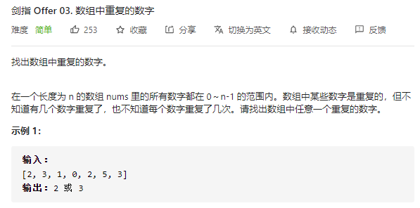

## 找出数组中重复的数字（简单）

问题描述：



#### 解1：无脑for

```javascript
/**
 * @param {number[]} nums
 * @return {number}
 */
var findRepeatNumber = function(nums) {
for (let i = 0; i < nums.length; i++) {
        for (let j = 0; j < nums.length; j++){
            if(i !== j && nums[i] === nums[j]) {
                return nums[i]
            }
        }
    }
};
```

#### 解2：先排序，后判断相邻数是否相等

​	运行效果：速度快

```javascript
/**
 * @param {number[]} nums
 * @return {number}
 */
var findRepeatNumber = function(nums) {
    nums.sort();
    for(let i=0;i<nums.length;i++){
        if(nums[i+1] == nums[i]) return nums[i];
    }
    return null;
};
```

