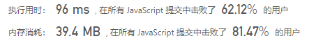

## 托普利茨矩阵（简单）

问题描述：


我的解：

```javascript
/**
 * @param {number[][]} matrix
 * @return {boolean}
 */
var isToeplitzMatrix = function(matrix) {
  let row_length = matrix[0].length;
  let column_length = matrix.length;
  let size = Math.min(row_length,column_length);
  const org = matrix[0][0];
  let t = 0;
  for (let i = 0; i < size; i++) {
    if (matrix[i][i] !== org) {
      return false
    }else {
      t = matrix[i][i];
    }
  }
  if (t === org) {
    return true
  }
};
```

答案错误：原因->审题错误，只考虑了对角线的情况

```javascript
/**
 * @param {number[][]} matrix
 * @return {boolean}
 */
var isToeplitzMatrix = function(matrix) {
  const m = matrix.length, n = matrix[0].length;
  for (let i = 1; i < m; i++) {
    for (let j = 1; j < n; j++) {
      if (matrix[i][j] !== matrix[i - 1][j - 1]) {
        return false;
      }
    }
  }
  return true;
};
```

