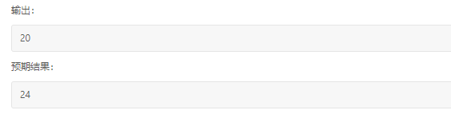
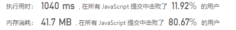

## 爱生气的书店老板（中等）

问题描述：


我的解：

​	根据示例最开始的思路：

```javascript
let customers = [1,0,1,2,1,1,7,5,2,1];
let grumpy = [0,1,0,1,0,1,0,1,0,1];
const X = 3
function maxSatisfied(customers, grumpy, X) {

  // 找到连续三个元素求和最大的位置
  let max = 0, p = 0, total = 0;
  for (let i = 0; i <= customers.length - X; i++){
    let sum = 0;
    for (let j = 0; j < X; j ++){
      sum += customers[i+j];
      if(sum > max) {
        max = sum;
        p = i;
      }
    }
    console.log(sum);
  }
  console.log(max,p);

  // 将grumpy中对应位置的元素置0
  for (let m = 0; m < grumpy.length; m++) {
    if (m === p) {
      for (let j = 0; j < X; j++) {
        grumpy[p+j] = 0;
      }
    }
  }
  console.log(grumpy);

  // 如果grumps中的元素为0，将customers中对应的元素求和
  for (let m = 0; m < grumpy.length; m++) {
    if (grumpy[m] === 0) {
      total += customers[m];
    }
  }
  console.log(total);
};
maxSatisfied(customers,grumpy,X);
```

​	这种情况下导致：	

​		当输入为customers=【4,10,10】，grumpy=【1,1,0】，X=2时提交失败



​	所以，重新整理思路

```javascript
let customers = [1,0,1,2,1,1,7,5];
let grumpy = [0,1,0,1,0,1,0,1];
const X = 3
function maxSatisfied(customers, grumpy, X) {

  let max = 0;
  const grumpy_copy = [].concat(grumpy);
  for (let i = 0; i <= grumpy.length - X; i++) {

    // 先将grumpy中X窗口大小中的1置0
    for (let j = 0; j < X; j++) {
      grumpy[i+j] = 0;
    }
    console.log('grumpy',grumpy);

    // 计算customers中对应元素的和
    let total = 0;
    for (let m = 0; m < grumpy.length; m++) {
      if (grumpy[m] === 0) {
        total += customers[m];
        if (total >= max) {
          max = total;
        }
      }
    }
    console.log(total);
    grumpy = [].concat(grumpy_copy);
  }
  console.log(max);

};
maxSatisfied(customers,grumpy,X);
```

​	这样做，复杂度太高，超出时间限制

​	继续整理思路：

```javascript
let customers = [4,10,10];
let grumpy = [1,1,0];
const X = 2;
function maxSatisfied(customers, grumpy, X) {

  let max = 0, total = 0;

  // 计算原始grumpy为0时的总和
  for (let m = 0; m < grumpy.length; m++) {
    if (grumpy[m] === 0) {
      total += customers[m];
    }
  }
  console.log(total);

  for (let i = 0; i <= grumpy.length - X; i++) {

    // 计算窗口里的customers求和的值
    let sum = 0, org = 0, final = 0;
    for (let j = 0; j < X; j++) {
      sum += customers[i+j];
      // 计算grumpy中窗口内原来的值
      if (grumpy[i+j] === 0) {
        org += customers[i+j];
      }
    }
    // console.log('sum',sum);
    // console.log('org',org);

    // 总和+窗口求和的值-窗口原来的值
    final = total + sum - org;
    if (final >= max) {
      max = final;
    }
  }

  console.log(max);
};
maxSatisfied(customers,grumpy,X);
```

终于成功了



官解：

```javascript
var maxSatisfied = function(customers, grumpy, X) {
    let total = 0;
    // 计算grumpy为0时，customers的总和
    const n = customers.length;
    for (let i = 0; i < n; i++) {
        if (grumpy[i] === 0) {
            total += customers[i];
        }
    }
    let increase = 0;
    // 计算窗口内，customers的和
    for (let i = 0; i < X; i++) {
        increase += customers[i] * grumpy[i];
    }
    let maxIncrease = increase;
    for (let i = X; i < n; i++) {
        increase = increase - customers[i - X] * grumpy[i - X] + customers[i] * grumpy[i];
        maxIncrease = Math.max(maxIncrease, increase);
    }
    return total + maxIncrease;
};
```

