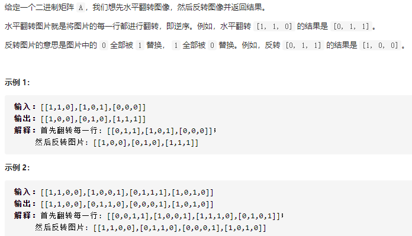
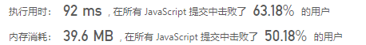

## 翻转图像（简单）

问题描述：



我的解：

```javascript
/**
 * @param {number[][]} A
 * @return {number[][]}
 */
var flipAndInvertImage = function(A) {
 let len = A.length;
  for (let i = 0; i < len; i++) {
    A[i].reverse();
    for (let j = 0 ;j < A[i].length; j++) {
      if (A[i][j] === 0) {
        A[i][j] = 1;
      }else {
        A[i][j] = 0;
      }
    }
  }
  return A
};
```

思路：先将数组中的每一行，使用reverse()方法颠倒数组每一行元素的顺序

​		  再将0和1之间进行转换

效果：



