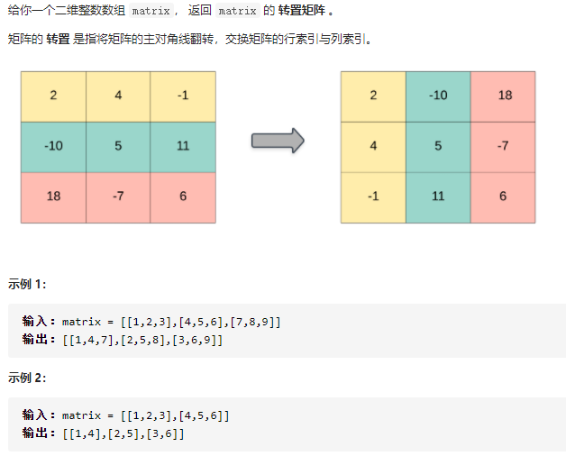

## 转置矩阵（简单）

问题描述：



我的解：

```javascript
/**
 * @param {number[][]} matrix
 * @return {number[][]}
 */
var transpose = function(matrix) {
const m = matrix.length;
  const n = matrix[0].length;
  // 设置固定维度的转置矩阵大小
  const final = new Array(n).fill(0).map(() => new Array(m).fill(0));
  for (let i = 0; i < m; i++) {
    for (let j = 0; j < n; j++) {
      final[j][i] = matrix[i][j];
    }
  }
  return final;
};
```


第二种想法：

```javascript
let matrix = [[1,2,3],[4,5,6]];
function transpose(matrix) {
  const m = matrix.length;     // 列
  const n = matrix[0].length;  // 行
  let final = [];
  
  /*将每一列的元素添加到row中*/
  for (let i = 0; i < n; i++) {
    let row = [];
    for (let j = 0; j < m; j++) {
      row.push(matrix[j][i]);
    }
    /*最后将每一行（row）添加到final中*/
    final.push(row);
  }
}
transpose(matrix);
```

