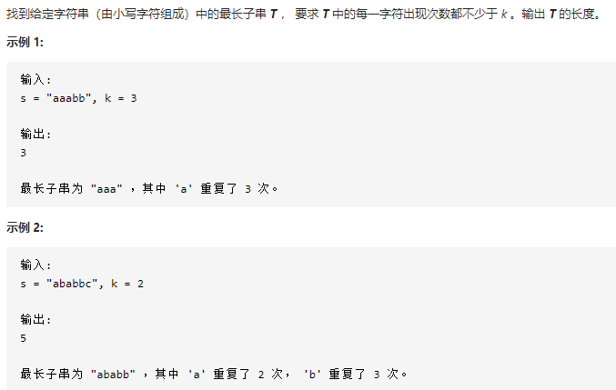
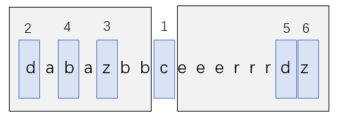

## 至少有K个重复字符的最长子串（中等）

问题描述：



官解：递归切割的思想



```javascript
let s = "dababzbceeerrrdz";
const k = 2
var longestSubstring = function(s, k) {
  const n = s.length;
  return dfs(s, 0, n - 1, k);
}

// s——>字符串 l——>初始索引  r——>字符串最后的索引值  k——>个数限制
const dfs = (s, l, r, k) => {
  const cnt = new Array(26).fill(0);
  for (let i = l; i <= r; i++) {
    cnt[s[i].charCodeAt() - 'a'.charCodeAt()]++;
  }

  console.log(cnt);
  // 将<k的进行切割
  let split = 0;
  for (let i = 0; i < 26; i++) {
    if (cnt[i] > 0 && cnt[i] < k) {
      split = String.fromCharCode(i + 'a'.charCodeAt());     /*返回代表unicode的字符*/
      console.log(split);
      break;
    }
  }
  if (split == 0) {
    return r - l + 1;
  }

  let i = l;
  let ret = 0;
  while (i <= r) {
    while (i <= r && s[i] === split) {
      i++;
    }
    if (i > r) {
      break;
    }
    let start = i;
    while (i <= r && s[i] !== split) {
      i++;
    }

    const length = dfs(s, start, i - 1, k);
    ret = Math.max(ret, length);
  }
  return ret;
};
console.log(longestSubstring(s, k));
```

