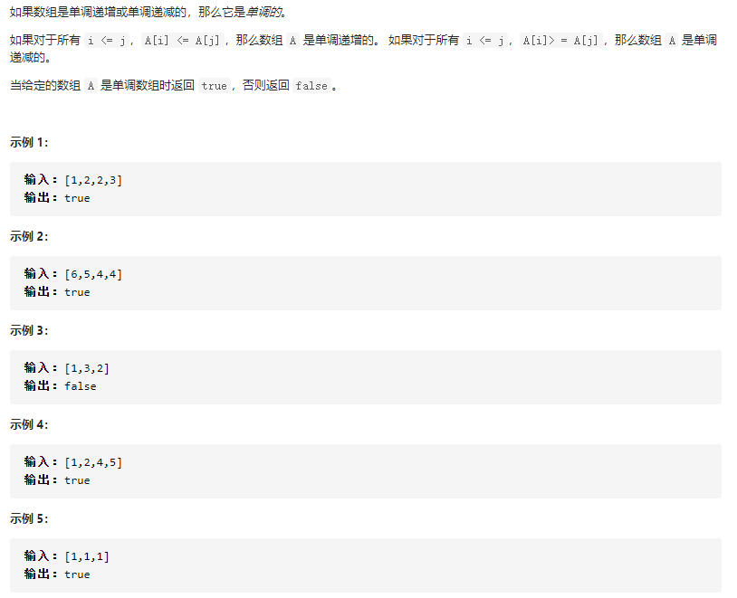

## 单调数列（简单）

问题描述：



我的解：

```javascript
let A = [11,11,9,4,3,3,3,1,-1,-1,3,3,3,5,5,5];
let isMonotonic = function(A) {
  let inc = true, dec = true;
  const n = A.length;
  for (let i = 0; i < n - 1; ++i) {
    if (A[i] > A[i + 1]) {
      inc = false;
    }
    if (A[i] < A[i + 1]) {
      dec = false;
    }
  }
  return inc || dec
};
console.log(isMonotonic(A));
```

